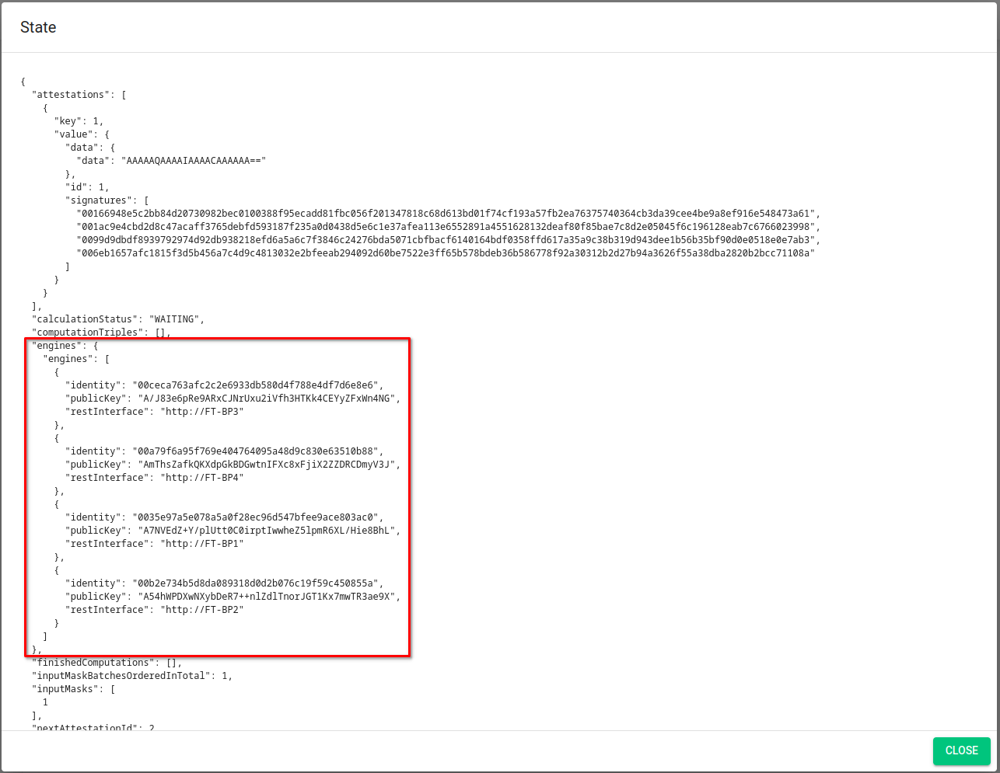

# Test the live example of our voting contract

   
   
   
   
   
   <!-- Repeat above for more dots -->

!!! note 
    Before you can test the already deployed example, you need the following setup:

    1. A [testnet](/docs/testnet.md) [PBC account](/docs/accounts.md) [with gas](/docs/byoc.md)
    2. A test ethereum account with gas on the Goerli testnet. To get some gas on Goerli testnet we used [a faucet from the official docs](https://ethereum.org/en/developers/docs/networks/#goerli)

    We suggest to use [metamask](/docs/accounts.md) for Goerli testnet.

## Register PBC account as a voter on Ethereum

1. Go to [https://goerli.etherscan.io/address/0x<todo>](https://goerli.etherscan.io/address/0x<todo>).
2. Press the “Contract” button and then the “Write Contract” button to interact with the public contract.
3. Choose the action “register” and enter your PBC account address (write as “0x<address\>”), and press “Write” to send the register transaction. You may need to connect your wallet via the “Connect to Web3”.
4. Verify that the registration was successful by finding the registration event under the tab “Events”.

## Transfer voter registration to PBC

1. Go to [https://testnet.partisiablockchain.com/info/contract/<todo>](https://testnet.partisiablockchain.com/info/contract/<todo>)
2. Press the "Register Voter" button and then "Submit". This registers you with the account you are currently logged onto PBC with.
3. Verify that the account was registered by finding its address as the latest entry in the registered voters list in the contract state. 

## Casting secret votes on the PBC contract

1. Navigate to the voting interface on PBC and click the “Cast Vote” button to input your secret vote.
   Choose the "True" option for casting a "yes" vote, or the "False" option for casting a "no" vote.
   Press the "Submit" button to send the secret vote.
2. Your cast vote is now pending confirmation by the computation nodes. This may take a minute or two depending on the network activity. 
3. You can verify that the vote has been confirmed by inspecting the "ZK State as JSON" button. 
4. The JSON data contains a lot of information, but we are only interested in the "pendingInput" and 
   "variables" lists. 
5. When casting a vote it is added to "pendingInput" and when it has been confirmed it is moved to 
   the "variables" list. 
6. In both lists the "variable" has an "owner" field, which contains the address of the PBC account 
   that cast the vote. 
7. To see that your votes has been confirmed, check that it has been moved from "pendingInput" to 
   "variables". You may need to refresh the page to update the state. 
8. To make the example more interesting you could cast multiple votes, but note that you can only 
   cast one vote per account.

## Counting secret votes
!!! note
    Before counting votes you should note the id of the current vote. This is required to find the result later.

1. Start the vote counting process by pressing the "Start Vote Counting" button and then "Submit". This will initiate the ZK computation and new votes cannot be cast while it is running. The computation can take a minute or two to finish. 
   
   If the action fails it might be because a vote has not been confirmed yet or if another has started the voting before you. You can see if the result shows up, otherwise you can retry the Start Vote Counting after a couple of minutes.
   
2. Once the computation has ended, the result of the vote is added to the list of "vote_results". You may have to refresh the page to update the state.
3. Find the result with the vote id that you noted earlier.
4. As this is an open voting example, it may be challenging to fully verify the expected result. However, the result should include at least the number of votes cast or more.
5. The result should also contain a proof of the result. The proof is a list of signatures. If it does not contain signatures, wait some more and refresh the page.

By following these steps you have now cast a secret vote and counted the result using PBC.

If you encounter any issues while casting your vote or counting the result, you are always welcome to ask for assistance in our [active community](https://partisiablockchain.com/community).

## Transfer the result securely back to Ethereum

These steps shows you how to securely move the vote result to the Ethereum public voting contract while ensuring integrity.

1. To securely move the result to the Ethereum public voting contract, go back to [the contract on etherscan](https://goerli.etherscan.io/address/0x<todo>) and find the “publishResult” action under “contract” and then ”write contract”.
2. Fill in the values of the vote result and the proof of the result shown in PBC.
3. Try and alter the result to see for yourself that it is tamper-proof when trying to add votes or other kinds of manipulation. You will see that the transaction will fail when doing so.

## Optionally validate the PBC &rarr; Ethereum link

Following the example above, it may be a bit difficult to see how the transfer of data to Ethereum is secured, i.e. who signs the result of a vote and how does Ethereum verify the signatures?

As illustrated on the [concept page](pbc-as-second-layer.md), the result is signed by the same nodes that run the ZK computation. When trusting these nodes to handle the computation securely, we can also trust them to sign the result correctly.

To be able to verify the signatures on the Ethereum side, the smart contract needs to know the identities of the computation nodes. Additionally, the Ethereum smart contract also needs to know the address of the smart contract that ran the secret vote on PBC.

### Validating contract address

Validating that the Ethereum smart contract links to the right secret voting contract is straight 
forward.

[On etherscan](https://goerli.etherscan.io/address/0x<todo>), find the `privateVotingPbcAddress` in 
the contract state. This is a state variable of 21 bytes, that should correspond to the address of 
the secret voting contract on PBC, i.e. `0x03<todo>`.

### Validating computation nodes identities

Validating that the Ethereum smart contract knows the computation nodes' identities is a bit more 
complicated.

[On etherscan](https://goerli.etherscan.io/address/0x<todo>), find the `computationNodes` in
the contract state. This is a list of Ethereum addresses corresponding to the computation nodes on 
the PBC secret voting contract.

Next, [on PBC](https://testnet.partisiablockchain.com/info/contract/<todo>) read the 
"ZK State as JSON", and find the list called "engines". This list contains 4 objects which holds
information about the ZK computation nodes, including their PBC address listed as "identity".

You may notice that that four addresses listed on the two contracts are not the same. To understand
why this is the case, you can read about how addresses are derived on either chain 
[here](pbc-as-second-layer-technical-differences-eth-pbc.md).

The four engine objects also has a field called "publicKey" which is the public key that corresponds to the private key they used to sign the voting result. The addresses listed on the Ethereum contract were derived from these keys.

To validate that the keys corresponds to the addresses that the Ethereum contract knows, do the following for each key _k_ in the "engines" list.

1. Key _k_ is represented as a [compressed elliptic curve point](<todo>) in Base64 encoding
2. Convert _k_ to the uncompressed form. This can be done e.g. by using the PBC 
   `BlockchainPublicKey` java class and [getting the uncompressed EC points](https://gitlab.com/partisiablockchain/core/contract/-/blob/main/src/main/java/com/partisiablockchain/crypto/BlockchainPublicKey.java#L138)
   from that.
   * You can also use the helper script `publicKeys.js` found in the code for the 
     [example voting contracts](https://gitlab.com/partisiablockchain/language/<todo>).
3. Derive the Ethereum address from the uncompressed public key. This can be done with an 
   [online calculator](https://www.rfctools.com/ethereum-address-test-tool/) or programmatically.
4. The derived Ethereum address should match one of the addresses in the Ethereum smart contract's 
   state.
