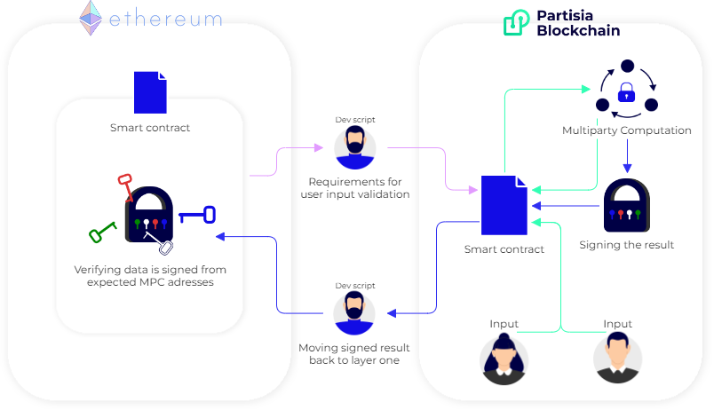

# Partisia Blockchain as a second layer

This article explains how Partisia Blockchain (PBC) can function as a second layer. We will dive into a running example and demonstrate how to test the implementation from the Ethereum testnet to our [PBC testnet](../testnet.md). Lastly, we will explain how to develop and recreate our testnet solution to get you started with using PBC as a second layer.

To use PBC's zero-knowledge contracts as a second layer to handle privacy, secrecy or other great possibilities, the minimum viable design stays the same.
We need to deploy two smart contracts: one zero-knowledge smart contract on PBC and a public smart contract on the layer one chain. The public functionality of the contracts will be very similar, but the contract on PBC can privately calculate the result using zero-knowledge computation. This design can be made onto any EVM chain with PBC as second layer and we focus on ETH in this guide because we have designed our running example around that particular chain. The PBC steps are the same and the concept needs to be similar in design.

The author of the contracts determines what information should be given to the public record and what should not be given to the public record across layer 1 and 2. User input should go to the necessary contracts to either A) give input publicly for layer one or two, or B) give input privately directly onto layer two contract. This is one of the main reasons of using PBC as second layer to determine what input goes where and how we handle such input either privately or publicly.

To describe the technical workflow around PBC as second layer we'll use the above model as reference.
On Ethereum we have deployed a .sol smart contract, the smart contract takes input in the form of who is allowed to vote. The who-is-allowed-to-vote input from the contract needs to be transferred onto PBC and we would use an outside script to move such data between the chains. It cannot be moved automatically from contract to contract.

After moving the voter input to PBC, the PBC smart contract now knows what votes it can accept and from where. The voters input would need to come directly to the smart contract on PBC to ensure the privacy of the vote. When the smart contract on PBC has enough votes and its trigger has been met for counting the votes, it will take all the votes and send them to the prepicked MPC node operators, also called zero-knowledge nodes. The ZK nodes will handle our computation privately without knowing the voters and votes themselves. You can read more about the MPC process [here](../dictionary.md#mpc)

When the computation is done the nodes will sign and encrypt the package before delivering it back to the smart contract where we can move the now signed data through another outside script to the Ethereum chain. The Ethereum contract then needs to verify that the signatures are from the expected MPC adresses before publishing the results of the vote.

## How do we handle the information and make sure the middle man is not cheating the users of the smart contracts?

Ensuring that the middle man is not cheating is an important aspect of how PBC works as a second layer. The package that will be delivered from PBC will be signed with unique keys, as shown on the above model, from our node operators(the ZK nodes for this specific contract) that has done the MPC calculation. This signed package is the package that will need to be moved to the SOL contract to publish the public result of your contracts. The layer one contract would need to be able to validate the signed keys from the prepicked node operators.

The contract owner must manually add certain information from the state of the deployed Partisia Blockchain (PBC) contract to the contract on layer one. The layer one contract must contain the identities (PBC addresses) of the ZK nodes allocated to perform the zero knowledge computation. This is necessary because the outcome from PBC uses signatures from the ZK nodes to prove themselves as the actual outcome of the computation from PBC. The signatures include the identity of the ZK nodes and the result which the respective nodes approved.
