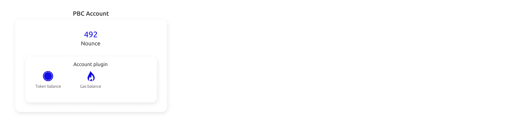

# Accounts

Create an account through the [wallet extension](https://chrome.google.com/webstore/detail/partisia-wallet/gjkdbeaiifkpoencioahhcilildpjhgh) or when you buy [MPC tokens](https://kyc.partisiablockchain.com/) for staking on a node.

Every account has an individual private key used for signing transactions, this key has a public counterpart called a public key.

A Partisia Blockchain account holds the information necessary to enabling the user to perform transactions. This information includes:

 - A unique identity called an address, it is derived from the [public key](keys.md)
 - The account balance of [BYOC](/docs/PBCFundamentals/byoc.md)
 - Balance of [MPC Tokens](/docs/PBCFundamentals/introduction.md)
 - An account [nonce (number used only once)](/docs/PBCFundamentals/dictionary.md#nonce), which is incremented when transactions are signed.

The above attributes except the nonce resides in the account plugin. But the account state itself holds a single piece of information: The nonce. This is a number that is incremented each time a transaction signed by an account is executed.

Accounts are used when sending transactions to any contract on the blockchain.
Since the account nonce is part of the signature it can be used only once. This means that an account holder can only execute one transaction for each block.  

### Relevant pages
[Bring Your Own Coin (BYOC), Gas and generel pricing](/docs/PBCFundamentals/byoc.md)