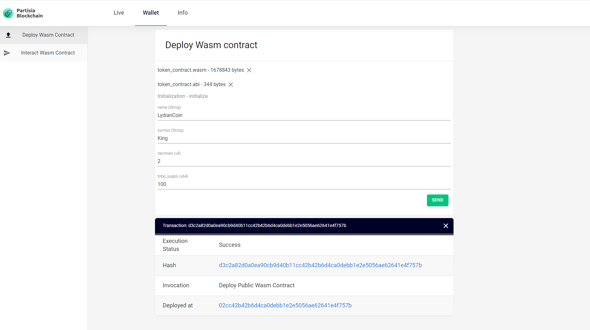

# Compile and deploy contracts

In the following sections we focus on the example token contract included in the example contract archive.
The contract utilizes several functions. The main functions are *initialize*, and *transfer* that 
allow you to perform the basic operations needed for a transfer.
After deployment the contract actions can be called from the dashboard. When you perform an action it
changes the contract state. If you inspect the contract you can see the serialized data showing
the contract state.

## 1) Compile a contract example

The token contract can be found in example contract archive: `contracts/example-token-contract`.
The following will compile it and generate an ABI for it:

```` bash
cd contracts/example-token-contract
cargo partisia-contract build --release
````

Now you will find a .wasm-file and a .abi-file in: 
`/target/wasm32-unknown-unknown/release`.

## 2) Upload the contract to the blockchain

To deploy a smart contract you need an [account](/docs/PBCFundamentals/accounts.md) with [gas](/docs/PBCFundamentals/byoc.md) to cover transaction costs. 
Open the wallet in the [Dashboard](https://dashboard.partisiablockchain.com/wallet/upload_wasm) 
or use [Partisia Blockchain Explorer](https://mpcexplorer.com/deploy-contract). 
Alternatively you can deploy for free test ETH [gas](/docs/PBCFundamentals/byoc.md) on the [testnet](https://testnet.partisiablockchain.com/). 
Select the `token_contract.wasm` and the `token_contract.abi`. 
The dashboard will then render a form for the initialization function. If you look at `lib.rs` file in your IDE, 
you will see that this matches the *initialize* function. 
The other three actions will be available after successful deployment.

If you need to tryout your smart contract, we recommend you tryout the [testnet](/docs/SmartContracts/testnet.md). 

In the *total_supply* field you put the number of tokens you want minted for total supply of the contract 
from the moment of deployment. 
The *decimals* field indicates placement of decimal point in total supply. 
E.g. total supply: 1050 decimals: 3 will mint supply of 1.050 token. After you send the contract to 
the chain a box appears below. You are provided with the following information fields 
*Execution status*, *Hash*, *Invocation* and *Deployed at*.  
Successful deployment will look like
this:



You are now ready to interact with the contract. Copy the address of deployment and paste it into the menu *Interact Wasm Contract* in the dashboard. Now you can mint and transfer your tokens.

<div class="embed-video-wrapper">
<iframe width="711" height="400" src="https://www.youtube.com/embed/qV2grtWDxUE" title="YouTube video player" frameborder="0" allowfullscreen></iframe>
</div>

Congratulations! You have now created an active smart-contract on the Partisia Blockchain.  
