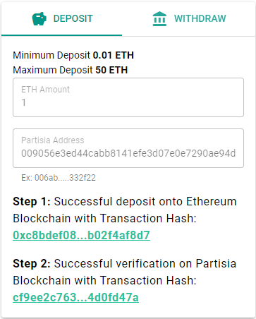

# BYOC and Gas 

### What is BYOC and gas  
BYOC means bring your own coin. The idea is that you can bring liquid cryptocurrencies onto PBC. A very small unit of BYOC is called gas. This is a term also used on other blockchains. Gas in the blockchain ecosystem is analogous with the fuel you need to get the machines moving. So to move something to the blockchain and change the state of things fuel is needed.

To pay the gas costs of transactions you need to have some amount of BYOC in your account. The costs cover the payment of the node operators which are providing the services enabling the transactions to take place.  

**How does it work**  
To be able to spend and transfer your coins, twins are minted which can interact with the payment scheme of PBC. So, in essence you can deposit, withdraw and transfer Etherum or other cryptocurrencies with your PBC wallet. 
The first cryptocurrency you are able to use in the BYOC system at PBC is Ethereum. Soon you will also be able to use USDC.    

## The cost for using the blockchain

The initial conversion rate for gas and gas price for different services on the blockchain has been chosen to roughly match the following prices in USD.

- Network fee: 5 USD cents/kb.
- CPU fee: 5 USD cents per 1000 instructions.
- Storage fee: 1 USD cent/kb per year.  

**NB.** Future prices may be subject to market mechanisms.

### How to get started

The easiest way to make a deposit of ETH s to use the PBC Token Bridge.   

1. Install the [Partisa Wallet Extension](https://chrome.google.com/webstore/detail/partisia-wallet/gjkdbeaiifkpoencioahhcilildpjhgh).
2. Make a Partisia Account with the wallet (or use the one you have already). You can use the Partisia Wallet to make additional accounts.
3. Install Metamask [app](https://metamask.io/) or [extension](https://chrome.google.com/webstore/detail/metamask/nkbihfbeogaeaoehlefnkodbefgpgknn).
4. Make an Ethereum account, you can use Metamask to do it.  
5. Set the network in Metamask to Ethereum Mainnet in upper right corner.
6. You can use Metamask to buy ETH. You can add funds with card or Apple Pay.
7. Use the  [PBC Token bridge](https://bridge.mpcexplorer.com/) to transfer ETH from the Ethereum account into the PBC account.

You get a confirmation as seen below if the deposit is successful. Your gas balance in the wallet should now be positive. This means that you can deploy or interact with smart contracts on the blockchain. Read more about smart contracts [here](contract-development.md). 

### How to get testnet gas   

The new testnet will be using [ETH from Goerli testnet](https://goerli.etherscan.io/address/0x4818370f9d55fb34de93e200076533696c4531f3).   

There are two ways to get gas on the testnet:   
A) using the bridge from test ETH GOERLI   
B) Using a Gas Faucet contract that mints BYOC   

### Method A
This mechanism for getting gas is the same as the old testnet and current mainnet (see above). The only difference is that you will have to switch the network, at which your wallet is pointing. We will announce when the network change becomes available in the wallet.

### Method B

The transaction in Method B costs a bit of gas to send, so you need to be bootstrapped either through Method A or by having another user with gas send you some gas using the faucet.   

- Sign in to the [testnet dashboard](https://testnet.partisiablockchain.com/) (Icon in upper right corner)   
- Follow this [link](https://testnet.partisiablockchain.com/info/contract/02d7c791bd9dd31a4a1a9fdaa99df7cc8414fd333e) to the Faucet contract   
- The contract action takes an account address as receiver of test ETH
- Execute the transaction - the specified account should now have gained approximately 1,000,000 gas (1M - TX cost).