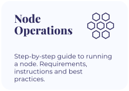

<h1 style="font-weight: bold;">Partisia Blockchain Documentation</h1>

Partisia Blockchain is built for trust, transparency, privacy and speed of light finalization. This is our official documentation where we introduce key concepts, fundamental understandings and onboard new external developers into the environment and teach you how to code smart contracts on PBC.

 

    

        
        
    

    

        
        
    

    

        
        
    

 

    
    

