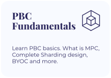
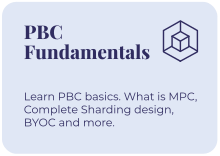
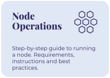

<h1 style="font-weight: bold;">Partisia Blockchain Documentation</h1>

Partisia Blockchain is built for trust, transparency, privacy and speed of light finalization. Partisia Blockchain is a pioneering technology that redefines the way we approach privacy and scalability in the world of blockchain.
  
What sets Partisia Blockchain apart is its unique combination of advanced cryptographic techniques and distributed computing principles. By leveraging secure multiparty computation (MPC), Partisia Blockchain ensures privacy preservation without sacrificing efficiency or security. This groundbreaking approach allows for confidential transactions, where sensitive data remains encrypted throughout the process, making it ideal for industries like finance, healthcare and many others. Moreover, Partisia Blockchain's scalable architecture enables high transaction throughput, making it suitable for decentralized real-world applications. 
  
This is our official documentation where we introduce key concepts, fundamental understandings, create new node operators and onboard new external developers into the environment and teach you how to code smart contracts on PBC.

 

    

        
        
    

    

        
        
    

    

        
        
    

 

    
    

    
    

