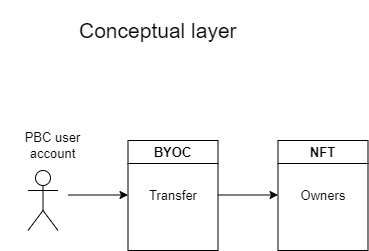

# The PBC Ecosystem

**Welcome to the documentation page of Partisia Blockchain.**  
Here you can find information that enables you to get the most out of PBC. If you are interested in making money by operating a node, or you want to use PBC as a platform for an app or use smart contracts, then you have come to the right place.  
Below is a small introduction to the some of the core concepts of blockchains and an explanation of what make PBC different from other blockchains. On webpage you can find topic specific guides that will help you to interact with PBC and get the maximal utility of our platform.


### What is a blockchain

Blockchains are a means to make an immutable record of transactions on a decentralized database. This makes blockchains a useful place to record important information e.g. of a financial, medical or legal nature.  
A blockchain is a public database where any update is added sequentially. Since all information is time stamped. You can add information in the present, but you cannot edit past information. In this way a blockchain creates an immutable ledger.

The name blockchain means that information added to the ledger comes in discrete bundles called blocks. A block points to the block before it. That way a chain is created that connects the changes on the ledger from the beginning to the present.
The blocks are connected cryptographically. The hash of each block is produced as a function of the hash of the transactions and the hash of the previous block.  

  

A blockchain exists on a distributed network of computers called [nodes](whatisano.md), therefore it does not rely on a single point like a centralized database and this eliminates the problem of trusting the database. A breach of one point in a distributed database still leaves the majority of servers intact and consequently the control of the data remains in the network.

### What happens when I use a blockchain
One very popular way in which users interact with the blockchain is to buy NFTs. In the illustrations and text below we will explore how a user action like purchase of NFTs affect the blockchain.  
On the surface level your phone or computer is connected to the internet. Apps and webpages can get you in contact with the blockchain through the internet just like using any other online service like e-mail.   

  

The Partisia blockchain lives on a network of computers connected to each other through the internet. When you use an app to facilitate a transaction on the blockchain the transaction is first checked for validity, this means living up to four conditions relating to signature, solvency of account, matching of nonce and expiration time. The conditions are specified [here](transactions.md). If the transaction is valid then it is put in a package with other incoming transactions called a block. This is done by a node chosen for the task, this node is referred to as the block proposer or sequencer. The proposer executes all transactions in the block and then send it to all immediate connected nodes for further execution. This way of spreading the information in the network is called flooding. When a node as executed all transactions in a block, it sends a proof of verification (information resulting from successful execution) to its sender node and signs the block. After a node has executed a block and sent proof to the sender, the process repeats and the node sends the block to its own connections and wait for proof of verification. When the block has been executed signed by a 2/3 majority constituting a proof of justification (PoJ), next block is introduced, when that block has been through the same process and a new (PoJ) is achieved, then original block is said to be finalized, meaning it cannot be rolled back. In other words, it is on an immutable record. In our example of buying an NFT, this would mean that there is a timestamped unchangeable record of that purchase, proving the ownership.  



If we move down to the conceptual layer, the transaction of buying the NFT is an expression of a change of state of active [smart contracts](contract-development.md). The contract related to the NFT has a state. The state of a contract stipulates the variables of the contract that are subject to being changed by transactions (Transactions that can change the state of a specific contract are referred to as the actions of the contract). In our NFT contract the state has an inventory listing the NFTs available and the [accounts](accounts.md) that own the individual NFTs. A user account has a plugin tracking their balance of liquid funds called [BYOC](byoc.md). When our account holder buys the NFT he does it by paying some of his BYOC into the account of the NFT's current owner. If the conditions for change of state are met, the state of the NFT contract is changed, namely the owner address associated with the purchased NFT has changed.


````json
#[state]
pub struct NFTContractState {
    NFTS: Vec<(Address,NFTId)>,
}
````


### What is special about Partisia Blockchain? - A privacy preserving blockchain

The advantages of a public blockchain comes with a tradeoff. The fact that everything that happens on the public blockchain is added to a permanent record limits the scope of their use. You can only use a public ledger for things you want everyone to know. Imagine you want to make use of the public blockchain to prevent voter fraud in a general election. The public blockchain can give you a transparent election without fraud, but the price will be compromising the privacy of the voters.

Partisia Blockchain comes with an extra privacy layer. This allows for [zero knowledge computations](https://medium.com/partisia-blockchain/mpc-techniques-series-part-8-zero-knowledge-proofs-what-are-they-and-what-are-they-good-for-2f39ed0eab39) to happen in parallel with the activities on the public blockchain. For our example that would mean that PBC could provide an election without the possibility of voter fraud and at the same time keep all votes secret. This way PBC expands the scope of use for a blockchain into much broader domains.  
For zero knowledge computation to happen simultaneous with the public activities on the blockchain it is necessary to allocate part of the nodes of the network to focus on these tasks. To increase security of these services even further nodes that partake in them are selected through an economic staking model. This means that the owners of the computers handling the sensitive data has a common interest with the users of Partisia Blockchain to protect the data and preserve their privacy. 

### Find out more

[**What is a node operator?**](whatisano.md)

[**How does the economy of PBC work?**](byoc.md)

[**What is a smart contract?**](contract-development.md)

[**How can I add zero knowledge computation to a smart contract?**](vickrey.md)
