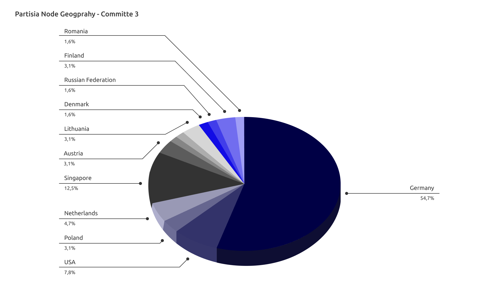

# VPS

## What is VPS

A VPS is a Virtual Private server. Just like you can have a virtual machines on your PC, it is possible to rent server space for virtual machine from an internet hosting service (IHS). That is called a VPS. You choose a VPS just like you would choose a PC. You decide on an operating system (OS), for running nodes on Partisia Blockchain you choose Linux based OS (In this guide we used Ubuntu).
Your VPS is physically capable of running the node if you align it with the [recommended machine specs](../node-operations/recommended-hardware-and-software.md).

## Where you get a VPS

There are numerous choices in service providers when it comes to VPS. In the illustration below you can see the geography of a committee of block producing nodes. There are many factors to weigh in when making your choice. but most important is to choose a provider you trust. There are at least 4 aspects to the location of your server, that you might want to consider:

- Location with adequate infrastructure? (Stable power grid and internet)
- Tax liabilities and property rights.
- Well-connected to remainder of the network. If the network was a spiderweb it would be advantageous to be at the center.
- Enhance the decentralization. As a rule of thumb for any investment, a broad portfolio has a greater probability of long term success. You can help to consolidate the chain against vulnerabilities by avoiding putting your node in the same location as everyone else. 

## Why you should use a VPS

Many users ask, "Is it OK if I keep the server at home?". You can make it work, but we advise against it. Servers at home suffers from the following problems:

**Home server**  

- Pets, children and spouses unplug your internet connection.   
- You boil water when the toaster is on, and you lose power.   
- You need to clean the basement or garage, you must move the server.   
- You get a new job and have to move.   

**VPS**  

- Stable internet and power connection.   
- Cloud hosting allows for backup of your server.   
- Renting a VPS is fairly cheap, and switching to a new one with different specs is much faster than getting a new physical server.   
