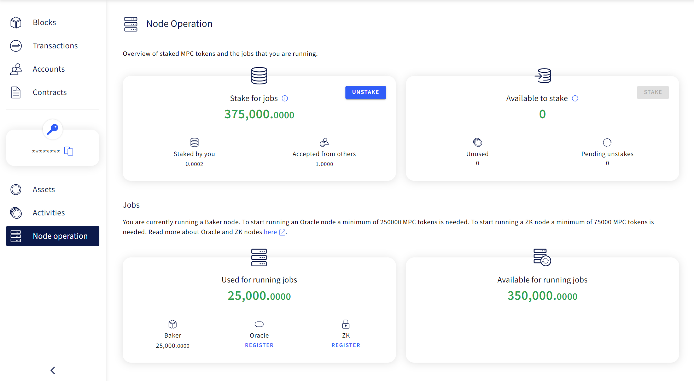
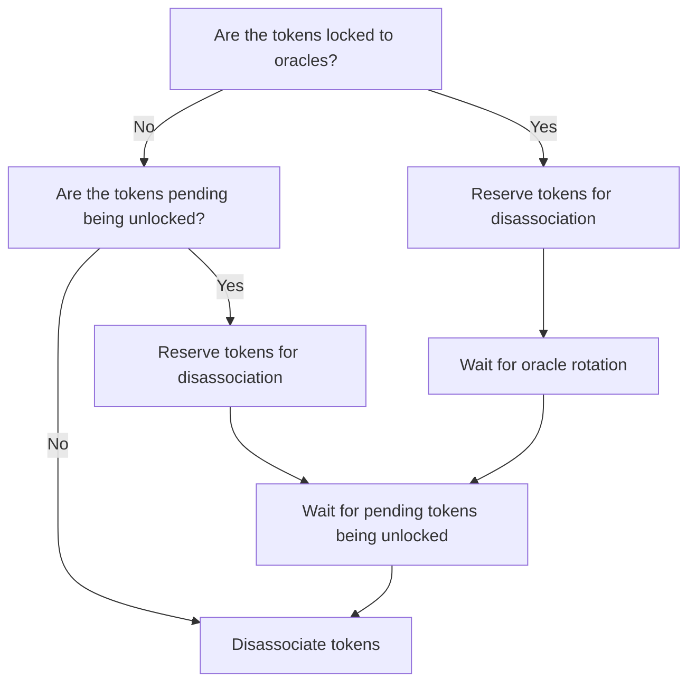

# Run a deposit or withdrawal oracle

The transfer of cryptocurrencies to and from PBC is facilitated by deposit and withdrawal
[oracles](../pbc-fundamentals/dictionary.md#oracle-node). Deposit and withdrawal oracles are a type
of [small oracle](../pbc-fundamentals/dictionary.md#small-oracle) and are constituted by three
nodes.

A minimum of 275k MPC tokens must be staked as collateral to provide deposit or withdrawal services.
In turn, deposit and withdrawal oracles receive 1% of the value of any transfer as a reward. These
rewards are then split evenly between the three nodes that form the oracle.

Below we explain how to make your node eligible to join a withdrawal or deposit oracle, and how to
leave an oracle if you wish to stop providing the service.

!!! Warning " You must complete these requirements before you can continue"

    1. [Run a baker node](run-a-baker-node.md)
    2. [Stake 250K MPC tokens](https://browser.partisiablockchain.com/node-operation). In addition to the 25K MPC tokens required to run a baker node.
    3. Ensure you have working BYOC endpoints in your `config.json` - [see how to confirm this](node-health-and-maintenance.md#confirm-that-your-byoc-endpoints-are-working)
    4. Ensure your baker node is [running](node-health-and-maintenance.md#is-your-baker-node-working)

## Register as a deposit or a withdrawal oracle node

To join a deposit or withdrawal oracle first you have to register your interest in joining one. This
can be done in [Browser](https://browser.partisiablockchain.com/blocks) from the **Jobs** section of
the [Node operation menu](https://browser.partisiablockchain.com/node-operation). This section
should show that 25K MPC are already allocated as stake for running a
[baker node](../pbc-fundamentals/dictionary.md#baker-node).

Step-by-step:

1. Go to [Node operation](https://browser.partisiablockchain.com/node-operation)
2. Sign in
3. Click "REGISTER" beneath _Oracle_ in the **Jobs** section
4. A registration menu will be displayed. Assign 250K MPC tokens as a stake and click on the
   REGISTER button

Now your stake has been associated to the large oracle contract and your node is eligible to join a
deposit or withdrawal oracle. You can confirm the amount staked to oracle services in the Jobs
section.

## How a node is selected for a deposit or withdrawal oracle

Nodes with 250K staked MPC tokens associated to the
[large oracle](../pbc-fundamentals/governance-system-smart-contracts-overview.md#node-operation)
contract are randomly selected to join deposit or withdrawal oracles. If your tokens are already
locked to a deposit or withdrawal oracle, you will not be selected to a new oracle until the
[epoch](../pbc-fundamentals/dictionary.md#epoch) ends and the
[pending period](node-payment-rewards-and-risks.md#how-long-does-it-take-to-retrieve-stakes-from-a-node-service)
is over.

When the deposit or withdrawal limit has been met, three new nodes will be selected. The tokens of
the three nodes associated with a specific oracle will get pending status for 14 days. Your node can
at any time serve in one oracle for each 250K tokens associated to the
[large oracle contract](https://browser.partisiablockchain.com/contracts/04f1ab744630e57fb9cfcd42e6ccbf386977680014/associateTokensToContract)
and it can be reselected to the same oracle if you have enough tokens associated.

## Deregister as a deposit or a withdrawal oracle node

To deregister as a deposit or a withdrawal oracle node you need to disassociate your tokens from the
large oracle contract. In some cases your tokens might not be immediately available for
disassociation. Please follow the
[flowchart](#flowchart-how-to-deregister-as-deposit-or-withdrawal-oracle) below in order to
disassociate your tokens.

After disassociating tokens from the large oracle contract, these tokens will no longer be available
for node selection in future oracle assignments. This effectively ensures that your node will not be
reselected for participation in oracles.

</>

!!!tip

    The steps in flowchart are clickable.

### How to check if your tokens are locked to oracles

1. Open the
   [large oracle contract state](https://browser.partisiablockchain.com/contracts/04f1ab744630e57fb9cfcd42e6ccbf386977680014?tab=state).
2. Open the map `stakedTokens`.
3. Search for your blockchain address `CTRL+f`.
4. Open the struct next to your blockchain address.
5. Open the map `lockedToOracle`.
6. You can see the addresses of the oracles your node serves and the amount of MPC tokens allocated
   to them (you can distinguish the price oracles from deposit and withdrawal oracles by looking at
   the amount of MPC tokes they have "locked"; price oracles have 5,000, deposit and withdrawal
   oracles 250,000).

### How to check if your tokens are pending unlock

1. Open the
   [large oracle contract state](https://browser.partisiablockchain.com/contracts/04f1ab744630e57fb9cfcd42e6ccbf386977680014?tab=state).
2. Open the map `stakedTokens`.
3. Search for your blockchain address `CTRL+f`.
4. Open the struct next to your blockchain address.
5. Open the map `pendingTokens`.
6. You can see the addresses of the oracles your node has tokens pending being unlocked for and the
   timestamp indicating when the tokens were released from an oracle.

### How to reserve tokens for disassociation

!!! info

    Reserving tokens for disassociation can prevent a node from being selected for new deposit and withdrawal oracles.
    If allocating tokens to a deposit or withdrawal oracle would cause the number of free tokens to fall below the
    amount reserved for disassociation, the node will not be selected for a deposit or withdaral oracle.
    When tokens are disassociated the reserved amount is automatically reduced by this amount.

1. Sign in to the browser.
2. Navigate to
   [ 'Set reserved tokens'](https://browser.partisiablockchain.com/contracts/04f1ab744630e57fb9cfcd42e6ccbf386977680014/setReservedTokens)
   on the large oracle contract.
3. Specify the new amount of tokens you want to reserve.
4. Confirm by pressing `SET RESERVED TOKENS`.

### How long does it take for the oracle to rotate

The oracle rotates when it reaches either the deposit limit of 25 ETH or the withdrawal limit of 50
ETH. If you cannot wait for the oracle to rotate, or if your node has to be shut down for
maintenance, you can [request a new oracle](#request-new-oracle) if the current oracle is at least
14 days old. This will end the [epoch](../pbc-fundamentals/dictionary.md#epoch) of the oracle and
new oracle nodes will be selected.

#### Request new oracle

1. Sign in to the browser.
2. Navigate to the deposit or withdrawal contract you want to request a new oracle for. See the full
   list of deposit- and withdrawal contracts
   [here](../pbc-fundamentals/byoc/bridging-byoc-by-sending-transactions.md#bridgeable-coins-on-mainnet).
3. Press `INTERACT` to open the list of actions and press `Request new oracle`.
4. Confirm by pressing `REQUEST NEW ORACLE`.

!!! note

    You can only invoke this action if you are part of the oracle and
    14 days have passed since the oracle was last changed. Confirm this in the contract state by checking the unix
    timestamp in the field named `"oracleTimestamp"`

### How long does it take for pending tokens to become unlocked

After being released from an oracle allocated tokens will be pending for 14 days before being
unlocked.

### How to disassociate tokens

1. Sign in to the browser.
2. Navigate to
   ['Disassociate tokens'](https://browser.partisiablockchain.com/contracts/04f1ab744630e57fb9cfcd42e6ccbf386977680014/disassociateTokensFromContract)
   on the large oracle contract.
3. Specify the amount you want to disassociate.
4. Confirm by pressing `DISASSOCIATE TOKENS FROM CONTRACT`.
