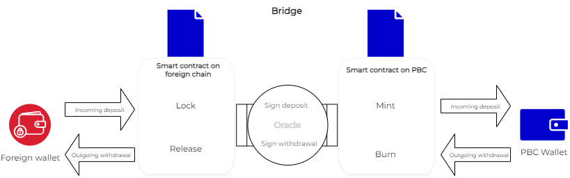
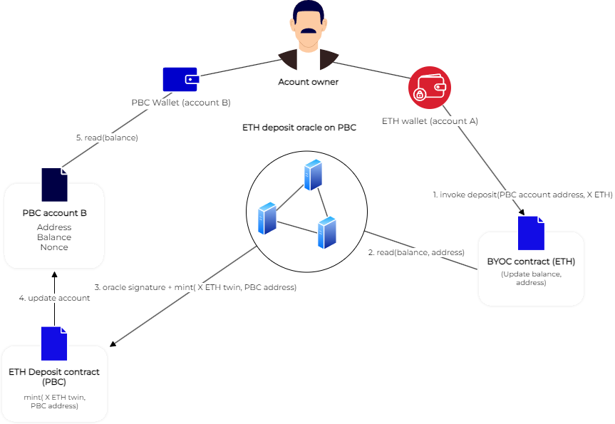
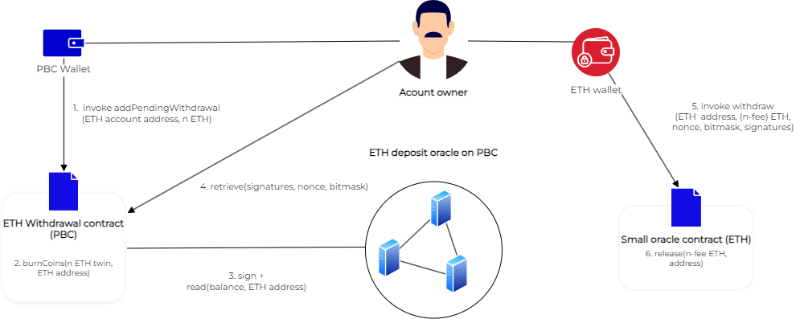

# Bridging BYOC by sending transactions


This guide explains how to use transactions to bridge liquid cryptocurrencies recognized by PBC (generally referred to as BYOC bring your own coin) from and to outside chains. 

For a guide to the bridging of BYOC with the bridge's UI see [here](byoc.md)

A Partisia Blockchain [account](create-an-account.md) holds the necessary information enabling the user to perform transactions. Among other fields the account state includes a balance of BYOC. Users can transfer BYOC between accounts internally on PBC, we call this BYOC transfer. It is also possible to transfer BYOC from and to other chains, we call this action bridging.   

## How does the bridge work

The basic idea behind the bridge is to move liquid cryptocurrencies to and from PBC.

&nbsp;



&nbsp;  

In the deposit and withdrawal examples  below we will assume, that you are trying to bridge ETH. The method used for other BYOCs is the same. Currently, BYOCs include ETH, Binance Coin and USDC. There is a detailed description below, describing which contracts and invocations are used for deposits and withdrawals.

**Safety**

The transfer of cryptocurrencies to and from PBC is facilitated by deposit and withdrawal [oracles](../node-operations/oracles-on-partisia-blockchain.md). Each of these oracles consist of 3 nodes with a 250K MPC tokens staked to the service. The stake of a node can be used to pay compensation for misconduct committed with the node. For deposit and withdrawal there is a maximum amount that can be transferred. When the limit is met three new nodes are selected to serve in the oracle. The value staked to the service vastly exceeds the maximum value that can be transferred in each given period until the limit has been met. You can learn more about the concept of staking in the [MPC token model](mpc-token-model-and-account-elements.md).

**Cost**

Every time the bridge is used 0.1% of transferred value is subtracted as a fee to pay for the service provided by oracle nodes. If you bridge 1 ETH, then 0.999 ETH is transferred and 0.001 ETH is paid to the oracle nodes.

#### How to make a deposit

BYOC acts as IOUs that can only be created when the equal sum of value is locked on the chain where the deposit comes from. The deposited coins are locked to the oracle contract on that chain. A deposit oracle consists of three PBC nodes, they monitor the BYOC contract for activity. When activity is detected and two out of three nodes of the oracle confirms a users locked funds, it invokes a contract action resulting in the minting of equivalent funds on PBC called BYOC.

**Deposit n amount of ETH from an ETH account to a PBC account**

1. Invoke the contract action _deposit_ on the [Small oracle contract on Ethereum](https://etherscan.io/address/0xf393d008077c97f2632fa04a910969ac58f88e3c#writeProxyContract):
```SOL
deposit(bytes21 destination, uint amount)
```
	* _bytes21_ is the receiving PBC address decoded to bytes 
	* _amount_ is ETH converted to Wei, minimum amount is 0.1 ETH
2. The contract locks n ETH
3. The oracle nodes read the incoming transaction on the [Small oracle contract on Ethereum](https://etherscan.io/address/0xf393d008077c97f2632fa04a910969ac58f88e3c#writeProxyContract)    
4. The action _deposit_ is invoked on [ETH Deposit](https://browser.partisiablockchain.com/contracts/045dbd4c13df987d7fb4450e54bcd94b34a80f2351/deposit) by the oracle nodes (the invocation requires 2/3 nodes invoke with same input) 
5. Given that 2 of 3 oracle nodes invoked deposit the contract mints n BYOC twins  
6. (n - fee) ETH are added to the balance the PBC account
7. The PBC wallet will read the account balance, now the account owner have access to the deposited funds


 

#### How to make a withdrawal

When you withdraw funds from PBC the BYOCs are first burned on PBC, then when the withdrawal oracle nodes confirm this, they each generate a signature. You need these to unlock the funds from the contract on the native chain.        


PBC nodes can read information on the native chains of the cryptocurrencies used for BYOC, e.g. a PBC node has an Ethereum endpoint and can read when a deposit have been made to a contract on Ethereum, but Ethereum nodes do not read information on PBC. So, in case of a withdrawal the user needs to provide information from the state of [ETH Withdraw](https://browser.partisiablockchain.com/contracts/043b1822925da011657f9ab3d6ff02cf1e0bfe0146?tab=state) on PBC to the [Small oracle contract on Ethereum](https://etherscan.io/address/0xf393d008077c97f2632fa04a910969ac58f88e3c#writeProxyContract).

**Withdraw n amount of ETH from a PBC account**   

1. Add a pending withdrawal on PBC by invoking the action _addPendingWithdrawal_ at [ETH Withdrawal](https://browser.partisiablockchain.com/contracts/043b1822925da011657f9ab3d6ff02cf1e0bfe0146/addPendingWithdrawal):
```JAVA 
 public ByocOutgoingContractState addPendingWithdrawal(
      SysContractContext context,
      ByocOutgoingContractState state,
      EthereumAddressRpc receiver,
      Unsigned256 amount) 
```
You can [download](https://browser.partisiablockchain.com/contracts/043b1822925da011657f9ab3d6ff02cf1e0bfe0146?tab=transactions) the contract ABI in upper right corner of the contract page. This helps you build a Typescript file that can help you build your transaction to call the contract with. Use ABI with this command:
```BASH
cargo partisia-contract abi --use https://gitlab.com/api/v4/projects/35039227/packages/maven/com/partisiablockchain/language/abi-client/3.25.0/abi-client-3.25.0-jar-with-dependencies.jar codegen --ts <path to .abi file> <output TS file>
```
2. ETH Withdrawal contract burns n ETH twins minus the fee to pay the oracle nodes
3. Each of the nodes in the ETH Withdrawal oracle confirming the ETH twins have been burned, then they generate the signatures necessary for a release from the ETH contract, (the signatures are available in the state of [ETH Withdraw](https://browser.partisiablockchain.com/contracts/043b1822925da011657f9ab3d6ff02cf1e0bfe0146?tab=state))
4. The account owner retrieve the nonce, signatures and bitmask from the [state](https://browser.partisiablockchain.com/contracts/043b1822925da011657f9ab3d6ff02cf1e0bfe0146?tab=state) waits until withdrawal have received at least two out of three signatures (this takes from zero to a few minutes, depending on activity level of the bridge)
5. Invoke the contract action _withdraw_ on the [small oracle contract on Ethereum](https://etherscan.io/address/0xf393d008077c97f2632fa04a910969ac58f88e3c#writeProxyContract), the action take an account address and the transferred amount:
```SOL
withdraw(uint64 withdrawNonce, 
   address destination, 
   uint amount, 
   uint32 bitmask, 
   bytes calldata signatures)
```
	* _withdrawNonce_ is found in the JSON state field named "key" 
	* you must subtract 0.1% (fee for oracle services) of the _uint amount_ compared with the amount in step 1 
	* _uint32 bitmask_ express which oracle nodes that have signed the withdrawal, e.g. 101 first and last node signed, input the three bits as the equivalent decimal number: (101)<sub>2</sub> = 5 				 
	* For each signature, 27 is added to the recovery id of the PBC-signature. This id needs to be moved to the end of the signature. e.g. a PBC-signature with a hex value of 01/.../ gives ETH-signature /.../1c
6. (n - fee) ETH are released from the [Small oracle contract on Ethereum](https://etherscan.io/address/0xf393d008077c97f2632fa04a910969ac58f88e3c#writeProxyContract) and again available for use by the owner the ETH account    


   
## Resources to get you started

You can use the [Metamask wallet](https://metamask.io/download/) to sign and send transaction for Ethereum, Polygon and BNB smartchain. This wallet is primarily designed for Ethereum, but can interact with the other chains as well.    
On Partisia Blockchain the easiest solution is to use [Partisia MetaMask Snap](https://snaps.metamask.io/snap/npm/partisiablockchain/snap/) to sign your transaction.  Alternatively you can use the [Partisia Wallet](https://chrome.google.com/webstore/detail/partisia-wallet/gjkdbeaiifkpoencioahhcilildpjhgh).

Besides the wallets, you will need the addresses of the [oracle](../node-operations/oracles-on-partisia-blockchain.md) contracts you want to interact with. Below is a complete list of our BYOC contracts on PBC and connected chains. On the testnet test BYOC from the ETH Goerli testnet is available, but no other BYOC test coins from other chains.

### Bridging test ETH

[ETH_GOERLI Deposit on PBC testnet](https://browser.testnet.partisiablockchain.com/contracts/045dbd4c13df987d7fb4450e54bcd94b34a80f2351)       
[ETH_GOERLI Withdrawal on PBC testnet](https://browser.testnet.partisiablockchain.com/contracts/043b1822925da011657f9ab3d6ff02cf1e0bfe0146)     
[Small oracle contract on Ethereum testnet](https://goerli.etherscan.io/address/0x4818370f9d55fb34de93e200076533696c4531f3)    
[Large oracle contract on Ethereum testnet](https://goerli.etherscan.io/address/0x5De7b80e5CeB9550ee1BeC3291b15e9B04E8de68)    

### Bridging ETH

[ETH Deposit on PBC](https://browser.partisiablockchain.com/contracts/045dbd4c13df987d7fb4450e54bcd94b34a80f2351)   
[ETH Withdrawal on PBC](https://browser.partisiablockchain.com/contracts/043b1822925da011657f9ab3d6ff02cf1e0bfe0146)   
[Small oracle contract on Ethereum](https://etherscan.io/address/0xf393d008077c97f2632fa04a910969ac58f88e3c)   
[Large oracle contract on Ethereum](https://etherscan.io/address/0x3435359df1d8c126ea1b68bb51e958fdf43f8272)   


### Bridging USDC

[POLYGON_USDC Deposit on PBC](https://browser.partisiablockchain.com/contracts/042f2f190765e27f175424783a1a272e2a983ef372)   
[POLYGON_USDC Withdrawal on PBC](https://browser.partisiablockchain.com/contracts/04adfe4aaacc824657e49a59bdc8f14df87aa8531a)   
[Small oracle contract on Polygon](https://polygonscan.com/address/0x4c4ecb1efb3bc2a065af1f714b60980a6562c26f)   
[Large oracle contract on Polygon](https://polygonscan.com/address/0x3435359df1d8c126ea1b68bb51e958fdf43f8272)   

### Bridging BNB Coin

[BNB Deposit on PBC](https://browser.partisiablockchain.com/contracts/047e1c96cd53943d1e0712c48d022fb461140e6b9f)   
[BNB Withdrawal on PBC](https://browser.partisiablockchain.com/contracts/044bd689e5fe2995d679e946a2046f69f022be7c10)   
[Small oracle contract on BNB Smartchain](https://bscscan.com/address/0x05ee4eee70452dd555ecc3f997ea03c6fba29ac1)   
[Large oracle contract on BNB smartchain](https://bscscan.com/address/0x4c4ecb1efb3bc2a065af1f714b60980a6562c26f)   


