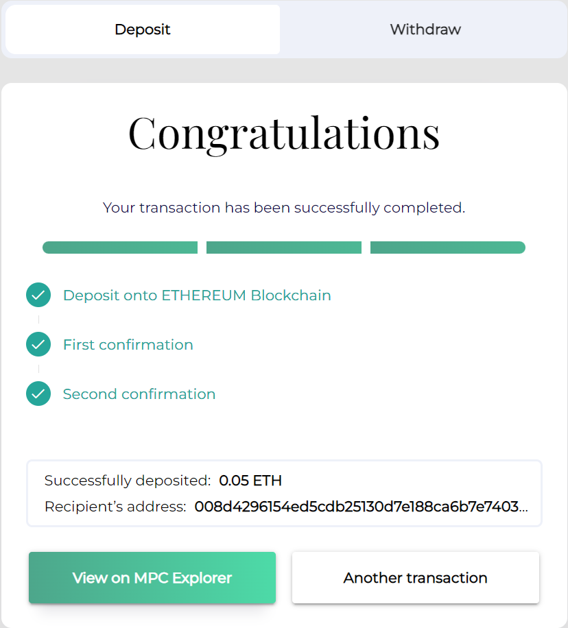

# BYOC and gas for the mainnet and testnet

### What is BYOC and gas

BYOC means bring your own coin. The idea is that you can bring liquid cryptocurrencies onto PBC. A very small unit of BYOC is called gas. This is a term also used on other blockchains. Gas in the blockchain ecosystem is analogous with the fuel you need to get the machines moving. So to move something to the blockchain and change the state of things fuel is needed.

To pay the gas costs of transactions you need to have some amount of BYOC in your account. The costs cover the payment of the node operators which are providing the services enabling the transactions to take place.

**How does it work**

To be able to spend and transfer your coins, you will need to transfer your own liquid cryptocurrency using [the PBC Token Bridge](https://bridge.mpcexplorer.com/). This will move your ETH to a contract and mint twins which can interact with the payment scheme of PBC. So, in essence you can deposit, withdraw and transfer ETH or other cryptocurrencies with your PBC wallet.
The first cryptocurrency you are able to use in the BYOC system at PBC is Ethereum. Soon you will also be able to use USDC.

## The cost for using the blockchain

Gas units are pegged to the USD. The fixed ratio is 100,000 gas units to 1 USD.

The price for different services on the blockchain has been chosen to roughly match the following prices in USD:

**Basic fees:**

- Network fee: 5 USD cents/kb.
- CPU fee: 5 USD cents per 1000 instructions.
- Storage fee: 1 USD cent/kb per year.

**ZK and Oracle fees:**

- BYOC (tentative):

  - 0,1% of the value transferred with a threshold of 25 USD as minimum transfer (equal to a BYOC fee of 2,5 USD cents).

- ZK computation:
  - Basic blockchain services priced with Basic fees
  - MPC multiplication fee (tentative): 5 USD cents per 1000
  - MPC triples fee (tentative): 5 USD cents per 1000 triples
  - Staking fee (tentative): 1% of the locked staked value per month. The locked stakes for ZK computations are set by the users.

Go [here](../smart-contracts/zero-knowledge-computation-gas-fees.md) for complete overview of costs for ZK services in gas.

- Token Bridge:
  - 1% of the value transferred with a threshold of 25 USD as minimum transfer (equal to a Token Bridge fee of 25 USD cents).

**NB.** Prices of ZK services are affected by the number of allocated ZK nodes and the used MPC protocol. All future prices may vary depending on market mechanisms.

### How to get started

The easiest way to make a deposit of ETH s to use the PBC Token Bridge.

1. Install the [Partisa Wallet Extension](https://chrome.google.com/webstore/detail/partisia-wallet/gjkdbeaiifkpoencioahhcilildpjhgh).
2. Make a [Partisia Account](../pbc-fundamentals/create-an-account.md) with the wallet (or use the one you have already). You can use the Partisia Wallet to make additional accounts.
3. Install Metamask [app](https://metamask.io/) or [extension](https://chrome.google.com/webstore/detail/metamask/nkbihfbeogaeaoehlefnkodbefgpgknn).
4. Make an Ethereum account, you can use Metamask to do it. (This is different from your Partisia Account)
5. Set the network in Metamask to Ethereum Mainnet in upper right corner.
6. You can use Metamask to buy ETH. You can add funds with card or Apple Pay.
7. Use the [PBC Token bridge](https://bridge.mpcexplorer.com/) to transfer ETH from the Ethereum account into the PBC account.

You get a confirmation as seen below if the deposit is successful. The confirmation also includes a link to the [mpc explorer](https://mpcexplorer.com/) where you can see the executed transaction. After the confirmed transfer your gas balance in the wallet should be positive. This means that you can deploy or interact with smart contracts on the blockchain. Read more about smart contracts [here](../smart-contracts/what-is-a-smart-contract.md).

### How to get testnet gas

The new testnet will be using [ETH from Goerli testnet](https://goerli.etherscan.io/address/0x4818370f9d55fb34de93e200076533696c4531f3). To see your testnet gas balance you will need to switch the network, at which your Partisia wallet is pointing to testnet.

There are two ways to get gas on the testnet:  
A) using the [bridge from test ETH GOERLI](https://testnet-bridge.mpcexplorer.com/)  
B) Using a Gas Faucet contract that mints BYOC

### Method A

This mechanism for getting gas is similar to the old testnet and current mainnet (see above). To get GoerliETH you need to find a faucet. This can be found using a simple web search. To see the GoerliETH in Metamask you need to change the network to the Goerli Test Network. After having deposited GoerliETH to your Metamask account you can use the [bridge from test ETH GOERLI](https://testnet-bridge.mpcexplorer.com/) to get gas on the testnet. The mpc explorer for the testnet can be found [here](https://testnet.mpcexplorer.com/).

### Method B

This method requires you to already have an account with a small amount of gas on the testnet. So, you need to be bootstrapped either through Method A or by having another user with gas send you some gas using this Gas Faucet contract.

- Sign in to the [testnet dashboard](https://testnet.partisiablockchain.com/) (Icon in upper right corner) Your private key can be recovered in the Partisia Wallet under Account Backup.
- Follow this [link](https://testnet.partisiablockchain.com/info/contract/02d7c791bd9dd31a4a1a9fdaa99df7cc8414fd333e) to the Faucet contract
- The contract action takes an account address as receiver of test ETH.
- By default, the dashboard sets the transaction cost to 100k gas which is excessive for this transaction. The transaction should take approximately 7k-10k gas.
- Execute the transaction - the specified account should now have gained approximately 1,000,000 gas (1M - TX cost).
