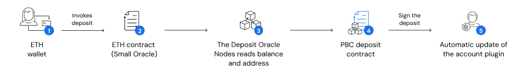

# Bridging BYOC by sending transactions


This guide explains how to use transactions to bridge liquid cryptocurrencies recognized by PBC (generally referred to as BYOC (Bring Your Own Coin)) from and to external chains. 

For a guide to the bridging of BYOC with the bridge's UI see [here](introduction-to-byoc.md)

A Partisia Blockchain [account](../create-an-account.md) holds the necessary information enabling the user to perform transactions. Among other fields the account state includes a balance of BYOC. Users can transfer BYOC between accounts internally on PBC, we call this BYOC transfer. It is also possible to transfer BYOC from and to other chains, we call this action bridging.   

## How does the bridge work

The idea behind the bridge is to move cryptocurrencies to and from PBC. 
In the deposit and withdrawal examples below, we will show how to bridge ETH. The method works for all BYOCs on PBC. Currently, BYOCs include ETH, BNB, USDC, MATIC, USDT and WMPC.

Below you will learn which contracts and invocations are used for deposits and withdrawals.
PBC nodes can read information on the native chains of the cryptocurrencies used for BYOC. In the case of a withdrawal, the user needs to provide information from the state of the withdrawal contract on PBC to the small oracle contract on the foreign chain.
The transfer of cryptocurrencies to and from PBC is facilitated by deposit and withdrawal [oracles](../dictionary.md#small-oracle).    

Every time the bridge is used, 0.1% of transferred value is subtracted as a fee to pay for the service provided by oracle nodes. If you bridge 1 ETH, then 0.999 ETH is transferred and 0.001 ETH is paid to the oracle nodes.

### How to make a deposit

BYOC acts as IOUs that can only be created when the equal sum of value is locked on the chain where the deposit comes from. The deposited coins are locked to the oracle contract on that chain. A deposit oracle consists of three PBC nodes, who monitor the BYOC contract for activity. When activity is detected and two out of three nodes of the oracle confirms a users locked funds, it invokes a contract action resulting in the minting of equivalent funds on PBC called BYOC.



**Deposit n amount of ETH from an ETH account to a PBC account**

1. Invoke the contract action _deposit_ on the [Small oracle contract on Ethereum](https://etherscan.io/address/0xf393d008077c97f2632fa04a910969ac58f88e3c#writeProxyContract):
```SOL
deposit(bytes21 destination, uint amount)
```
    * _destination_ is the receiving PBC address decoded to bytes 
    * _amount_ is ETH converted to Wei, minimum amount is 0.01 ETH
2. The contract locks n ETH
3. The oracle nodes read the incoming transaction on the [Small oracle contract on Ethereum](https://etherscan.io/address/0xf393d008077c97f2632fa04a910969ac58f88e3c#writeProxyContract)    
4. The action _deposit_ is invoked on [ETH Deposit](https://browser.partisiablockchain.com/contracts/045dbd4c13df987d7fb4450e54bcd94b34a80f2351/deposit) by the oracle nodes (the invocation requires 2/3 nodes to invoke with same input) 
5. Given that 2 of 3 oracle nodes invoked deposit the contract mints n BYOC twins  
6. (n - fee) ETH are added to the balance the PBC account
7. The PBC wallet reads the account balance, now you have access to the deposited funds


### How to make a withdrawal

When you withdraw funds from PBC the BYOCs are first burned on PBC, then when the withdrawal oracle nodes confirm this, they each generate a signature. You need these to unlock the funds from the contract on the native chain.        


**Withdraw n amount of ETH from a PBC account**

1. Add a pending withdrawal on PBC by invoking the action _addPendingWithdrawal_ at [ETH Withdrawal](https://browser.partisiablockchain.com/contracts/043b1822925da011657f9ab3d6ff02cf1e0bfe0146/addPendingWithdrawal):
```JAVA 
 public ByocOutgoingContractState addPendingWithdrawal(
      SysContractContext context,
      ByocOutgoingContractState state,
      EthereumAddressRpc receiver,
      Unsigned256 amount) 
```
2. The ETH Withdrawal contract burns n ETH twins minus the fee to pay the oracle nodes
3. When the ETH Withdrawal oracle confirms the ETH twins have been burned, they generate the signatures necessary for a release from the ETH contract. The signatures are available in the state of [ETH Withdraw](https://browser.partisiablockchain.com/contracts/043b1822925da011657f9ab3d6ff02cf1e0bfe0146?tab=state)
4. You retrieve the [nonce](https://partisiablockchain.gitlab.io/-/documentation/-/jobs/5230191090/artifacts/public/pbc-fundamentals/dictionary.html#nonce), signatures and bitmask from the [state](https://browser.partisiablockchain.com/contracts/043b1822925da011657f9ab3d6ff02cf1e0bfe0146?tab=state) waits until withdrawal have received at least two out of three signatures (this takes from zero to a few minutes, depending on activity level of the bridge)
5. Invoke the contract action _withdraw_ on the [small oracle contract on Ethereum](https://etherscan.io/address/0xf393d008077c97f2632fa04a910969ac58f88e3c#writeProxyContract), the action take an account address and the transferred amount:
```SOL
withdraw(uint64 withdrawNonce, 
   address destination, 
   uint amount, 
   uint32 bitmask, 
   bytes calldata signatures)
```
	* _withdrawNonce_ is found in the JSON state field named "key" 
	* you must subtract 0.1% (fee for oracle services) of the _uint amount_ compared with the amount in step 1 
	* _uint32 bitmask_ express which oracle nodes that have signed the withdrawal, e.g. 101 first and last node signed, input the three bits as the equivalent decimal number: (101)<sub>2</sub> = 5 				 
	* For each signature, 27 is added to the recovery id of the PBC-signature. This id needs to be moved to the end of the signature. e.g. a PBC-signature with a hex value of 01/.../ gives ETH-signature /.../1c
6. (n - fee) ETH are released from the [Small oracle contract on Ethereum](https://etherscan.io/address/0xf393d008077c97f2632fa04a910969ac58f88e3c#writeProxyContract) and again available for use by the owner the ETH account    

   
## Resources to get you started

You can use the [MetaMask wallet](https://metamask.io/download/) to sign and send transaction for Ethereum, Polygon and BNB smartchain. This wallet is primarily designed for Ethereum, but can interact with the other chains as well.  

On Partisia Blockchain the easiest solution is to use [Partisia MetaMask Snap](https://snaps.metamask.io/snap/npm/partisiablockchain/snap/) to sign your transaction.  Alternatively you can use the [Partisia Wallet](https://chrome.google.com/webstore/detail/partisia-wallet/gjkdbeaiifkpoencioahhcilildpjhgh).

Besides the wallets, you will need the addresses of the [oracle](../dictionary.md#small-oracle) contracts you want to interact with. Below is a complete list of our BYOC contracts on PBC and connected chains. On the testnet, test BYOC from the ETH Goerli testnet is available, but no other BYOC test coins from other chains.

To use a standardized digital asset on PBC you need to align with the [MPC-20 standard format](../../smart-contracts/integration/mpc-20-token-contract.md).

### Bridgeable coins on Mainnet

| **Currency**    | **Deposit oracle on PBC**                                                                                                  | **Withdrawal oracle on PBC**                                                                                                  | **Token contract on PBC** | **Small oracle on native chain**                                                                                                   | **Large oracle on native chain**                                                                                   | **Decimals** |
|-----------------|----------------------------------------------------------------------------------------------------------------------------|-------------------------------------------------------------------------------------------------------------------------------|--------------------------------------------------|------------------------------------------------------------------------------------------------------------------------------------|--------------------------------------------------------------------------------------------------------------------|:|
| BNB             | [BNB Deposit on PBC](https://browser.partisiablockchain.com/contracts/047e1c96cd53943d1e0712c48d022fb461140e6b9f)          | [BNB Withdrawal on PBC](https://browser.partisiablockchain.com/contracts/044bd689e5fe2995d679e946a2046f69f022be7c10)          | [BNB Token on PBC](https://browser.partisiablockchain.com/contracts/0137f4da8ad6a9a5305383953d4b3a9c7859c08bea) | [Small oracle contract on BNB Smart Chain (0x05...9ac1)](https://bscscan.com/address/0x05ee4eee70452dd555ecc3f997ea03c6fba29ac1)   | [Large oracle contract on BNB Smart Chain](https://bscscan.com/address/0x4c4ecb1efb3bc2a065af1f714b60980a6562c26f) |           18 |
| ETH             | [ETH Deposit on PBC](https://browser.partisiablockchain.com/contracts/045dbd4c13df987d7fb4450e54bcd94b34a80f2351)          | [ETH Withdrawal on PBC](https://browser.partisiablockchain.com/contracts/043b1822925da011657f9ab3d6ff02cf1e0bfe0146)          | [ETH Token on PBC](https://browser.partisiablockchain.com/contracts/014a6d0fd09fe2e6853a76caedcb46646ab7ee69d6) | [Small oracle contract on Ethereum (0xf3...8e3c)](https://etherscan.io/address/0xf393d008077c97f2632fa04a910969ac58f88e3c)         | [Large oracle contract on Ethereum](https://etherscan.io/address/0x3435359df1d8c126ea1b68bb51e958fdf43f8272)       |           18 |
| USDT (Ethereum) | [USDT Deposit on PBC](https://browser.partisiablockchain.com/contracts/040728ed459dd80c3653c544b63a57ae7a1144fe57)         | [USDT Withdrawal on PBC](https://browser.partisiablockchain.com/contracts/04c73a37ec8db48b86a2d76c978d4117e2282017ec)         | [USDT Token on PBC](https://browser.partisiablockchain.com/contracts/011150c3a2779309ff52e86c139ff58265a93fafd4) | [Small oracle contract on Ethereum (0x74...4cA4)](https://etherscan.io/address/0x74C0a1946d10FaF9048E9AC59D1401Bbbfc54cA4)         | [Large oracle contract on Ethereum](https://etherscan.io/address/0x3435359df1d8c126ea1b68bb51e958fdf43f8272)       |            6 |
| MATIC           | [MATIC Deposit on PBC](https://browser.partisiablockchain.com/contracts/0411b34e3b8965035fbc12c5ef05e1ed00c6d1261c)        | [MATIC Withdrawal on PBC](https://browser.partisiablockchain.com/contracts/04bcac555ce8397e120384fad0e148793a19ed980f)        | [MATIC Token on PBC](https://browser.partisiablockchain.com/contracts/01d9f82e98a22b319aa371e752f3e0d85bd96c9545) | [Small oracle contract on Polygon (0xe9...7CC1)](https://polygonscan.com/address/0xe98670C2cBAfB2205BC99eBE33093233F7f07CC1)       | [Large oracle contract on Polygon](https://polygonscan.com/address/0x3435359Df1D8C126ea1b68BB51E958fdf43F8272)     |           18 |
| USDC (Polygon)  | [POLYGON_USDC Deposit on PBC](https://browser.partisiablockchain.com/contracts/042f2f190765e27f175424783a1a272e2a983ef372) | [POLYGON_USDC Withdrawal on PBC](https://browser.partisiablockchain.com/contracts/04adfe4aaacc824657e49a59bdc8f14df87aa8531a) | [POLYGON_USDC Token on PBC](https://browser.partisiablockchain.com/contracts/01e0dbf1ce62c4ebd76fa8aa81f3630e0e84001206) | [Small oracle contract on Polygon (0x4c...c26f)](https://polygonscan.com/address/0x4c4ecb1efb3bc2a065af1f714b60980a6562c26f)       | [Large oracle contract on Polygon](https://polygonscan.com/address/0x3435359df1d8c126ea1b68bb51e958fdf43f8272)     |            6 |
| WMPC            | [WMPC Deposit on PBC (link pending)]() | [WMPC Withdrawal on PBC (link pending)]() | [WMPC Token on PBC (link pending)]() | [Small oracle contract on Ethereum (link pending)]()       | [Large oracle contract on Ethereum](https://etherscan.io/address/0x3435359df1d8c126ea1b68bb51e958fdf43f8272) |            4 |                                                                     

### Bridgeable coins on Testnet and test coin faucet

| **Testnet Coin**           | **Deposit oracle on PBC**                                                                                                                | **Withdrawal oracle on PBC**                                                                                                                | **Token Contract on PBC**                                                                                                              | **Small oracle on native chain**                                                                                                          | **Large oracle on native chain**                                                                                            | **Decimals** |
|----------------------------|------------------------------------------------------------------------------------------------------------------------------------------|---------------------------------------------------------------------------------------------------------------------------------------------|----------------------------------------------------------------------------------------------------------------------------------------|-------------------------------------------------------------------------------------------------------------------------------------------|-----------------------------------------------------------------------------------------------------------------------------|-------------:|
| ETH GOERLI                 | [ETH_GOERLI Deposit on PBC testnet](https://browser.testnet.partisiablockchain.com/contracts/045dbd4c13df987d7fb4450e54bcd94b34a80f2351) | [ETH_GOERLI Withdrawal on PBC testnet](https://browser.testnet.partisiablockchain.com/contracts/043b1822925da011657f9ab3d6ff02cf1e0bfe0146) | [ETH_GOERLI Token on PBC testnet](https://browser.testnet.partisiablockchain.com/contracts/01dce90b5a0b6eb598dd6b4250f0f5924eb4a4a818) | [Small oracle contract on Ethereum testnet (0x48...31f3)](https://goerli.etherscan.io/address/0x4818370f9d55fb34de93e200076533696c4531f3) | [Large oracle contract on Ethereum testnet](https://goerli.etherscan.io/address/0x5De7b80e5CeB9550ee1BeC3291b15e9B04E8de68) |           18 |
| TEST COIN (not bridgeable) | [TEST_COIN Faucet](https://browser.testnet.partisiablockchain.com/contracts/02c14c29b2697f3c983ada0ee7fac83f8a937e2ecd/feed_me)          | NA                                                                                                                                          | [TEST COIN Token on PBC testnet](https://browser.testnet.partisiablockchain.com/contracts/01f3cc99688e6141355c53752418230211facf063c)  | NA                                                                                                                                        | NA                                                                                                                          |            0 |
| WMPC                       | [WMPC Deposit on PBC testnet](https://browser.testnet.partisiablockchain.com/contracts/0410a0f2debd4fc6ecfe0ad8d9109c58633d885d4c)       | [WMPC Withdrawal on PBC testnet](https://browser.testnet.partisiablockchain.com/contracts/048738ff21d83d805e9c7d04a2425d910f83ede046)                                                                                                          | [WMPC Token on PBC testnet](https://browser.testnet.partisiablockchain.com/contracts/014ee6c73997d649b625addd53a5f6af766e3a3ca8)       | [Small oracle contract on Sepolia testnet](https://sepolia.etherscan.io/address/0xf67e05fcfcaaa4e58fbee76f362010215bff5998)               | [Large oracle contract on Sepolia testnet](https://sepolia.etherscan.io/address/0xc92d0E87f497F36489134437100A13895eC2feB6)                                                                                |            4 |