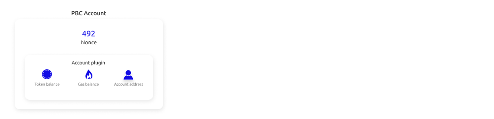

# Create an account

Create an account through the [wallet extension](https://chrome.google.com/webstore/detail/partisia-wallet/gjkdbeaiifkpoencioahhcilildpjhgh) or when you buy [MPC tokens](https://kyc.partisiablockchain.com/) for staking on a node.

Every account has an individual private key used for signing transactions, this key has a public counterpart called a public key, the short form of the public key is called the account address.

A Partisia Blockchain account holds the information necessary to enabling the user to perform transactions. An account hold the user's information such as your balance of MPC tokens
and [BYOC](../pbc-fundamentals/byoc/introduction-to-byoc.md). Only [system contracts](governance-system-smart-contracts-overview.md) can change the state of an account i.e. user deployed smart contracts
cannot change account balances. PBC has an open account structure, meaning that any private key of a valid format can
create a new account. Accounts and contracts reside on a specific [shard](sharding.md). You can find the values of any account attribute of a specific account by looking up the account address in the [browser](https://browser.partisiablockchain.com/accounts).

Every account has the attributes defined below:

- Address (a unique identity derived from the [public key](../pbc-fundamentals/dictionary.md#public-key-cryptography))
- Balance (the balance of [BYOC](../pbc-fundamentals/byoc/introduction-to-byoc.md))
- MPC tokens (the balance of[MPC Tokens](../pbc-fundamentals/mpc-token-model-and-account-elements.md))
- [Nonce (number used only once)](../pbc-fundamentals/dictionary.md#nonce) (the account nonce is incremented when transactions are signed)

The account state itself holds a single piece of information: The nonce. This is a number that is incremented each time a transaction signed by an account is executed. The rest of the account information resides in the account plugin.

Accounts are used when sending transactions to any contract on the blockchain.
Since the account nonce is part of the signature it can be used only once. This means that an account holder can only execute one transaction for each block.

### Relevant pages

[Bring Your Own Coin (BYOC), Gas and generel pricing](../pbc-fundamentals/byoc/introduction-to-byoc.md)
