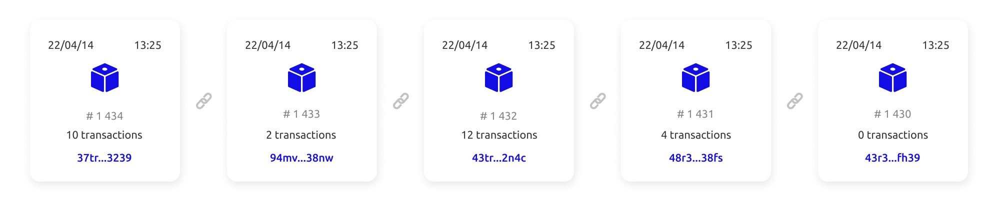
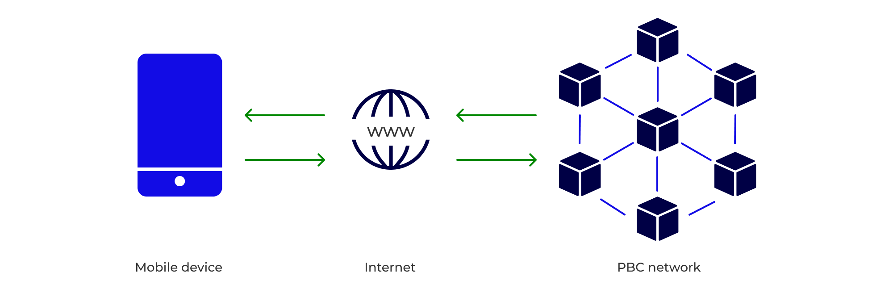
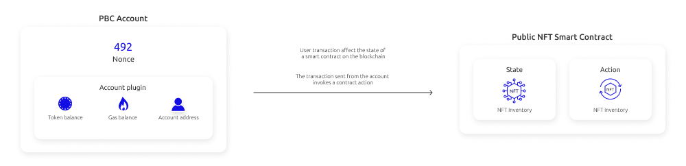

# Introduction to the fundamentals

Below is a small introduction to the some of the core concepts of blockchains and an explanation of what makes [Partisia Blockchain(PBC)](../pbc-fundamentals/dictionary.md#pbc) different from other blockchains.

### What is a blockchain

Blockchains are a means to make an [immutable record](../pbc-fundamentals/dictionary.md#pbc-ledger) of [transactions](../pbc-fundamentals/dictionary.md#transactions) on a decentralized database. This makes blockchains a useful place to record important information e.g. of a financial, medical or legal nature.  
A blockchain is a public database where any update is added sequentially. Since all information is time stamped. You can add information in the present, but you cannot edit past information. In this way a blockchain creates an immutable ledger.

The name blockchain means that information added to the ledger comes in discrete bundles called blocks. A block points to the block before it. That way a chain is created that connects the changes on the ledger from the beginning to the present.
The blocks are connected cryptographically. The hash of each block is produced as a function of the hash of the transactions and the hash of the previous block.

A blockchain exists on a distributed network of computers called [nodes](../node-operations/what-is-a-node-operator.md). Changes to the database happens to all the computers on the network through a secure [consensus mechanism](../pbc-fundamentals/consensus.md). In a traditional centralized database you just need to hack or compromise one computer and the integrety of all content on that database would be in jeopardy.  
Conversely, a blockchain is a decentralized database. Therefore, data on the blockchain remains secure even if a computer in the network is hacked, short circuits or loose connection to the internet.

### What happens when I use a blockchain

In the following paragraph we will examine user interactions with the blockchain using a purchase of an non-fungible token(NFT) as our case example. We will explore how a user action like purchase of NFTs affect the blockchain on different levels.  
On the surface level your phone or computer is connected to the internet. Apps and webpages can get you in contact with the blockchain through the internet just like using any other online service like e-mail.

The Partisia blockchain lives on a network of computers connected to each other through the internet. The blockchain comes with a software architecture which allows for binding trackable transactions to happen very fast.
A puchase of an NFT is a transaction on the blockchain. Specifically it is an action of an active [smart contract](../smart-contracts/what-is-a-smart-contract.md).

Smart contracts hold some information which can be changed, that information is called the state. The state of our NFT contract holds an inventory of NFTs and their owners. The contract action _Transfer_ can change the ownership of an NFT by changing an owner address in the inventory. Actions of contracts are themselves transactions on the blockchain. When they have been added to a block and executed, the resulting state change of the contract becomes part of the blockchain state. We now have a permanent timestamped record of the purchase.

### What is special about Partisia Blockchain? - A privacy preserving blockchain

The advantages of a public blockchain comes with a trade-off. The fact that everything that happens on the public blockchain is added to a permanent record limits the scope of their use. You use a public ledger for things you want everyone to know. Imagine you want to make use of the public blockchain to prevent voter fraud in a general election. The public blockchain can give you a transparent election without fraud, the tradeoff of using a public blockchain is that you are forced to publish to everyone what they voted and thereby compromising the privacy of the voters.

Partisia Blockchain comes with an extra privacy layer. This allows for [zero knowledge computations](https://medium.com/partisia-blockchain/mpc-techniques-series-part-8-zero-knowledge-proofs-what-are-they-and-what-are-they-good-for-2f39ed0eab39) to happen in parallel with the activities on the public blockchain. If we go back to our example of a general election being run on a blockchain, the PBC is able to provide an election without the possibility of voter fraud and at the same time keep all the votes a secret. The combination of the technologies of blockchain and [multiparty computation(MPC)](https://medium.com/partisia-blockchain/mpc-and-blockchain-a-match-made-in-heaven-df4291390b5b) expands the possibilities for blockchains immensely.
For zero knowledge computation to happen simultaneous with the public activities on the blockchain it is necessary to allocate part of the nodes of the network to focus on these tasks. To increase security of these services even further nodes that partake in them are selected through an economic staking model. This means that the owners of the computers handling the sensitive data has a common interest with the users of Partisia Blockchain to protect the data and preserve their privacy.

## Content

- [Introduction to the Partisia Blockchain fundamentals](../pbc-fundamentals/introduction-to-the-fundamentals.md)
- [Create an account on Partisia Blockchain (PBC)](../pbc-fundamentals/create-an-account.md)
- [BYOC and Gas ](../pbc-fundamentals/byoc.md)
- [$MPC token model and Account Elements](../pbc-fundamentals/mpc-token-model-and-account-elements.md)
- [Useful terms and definitions](../pbc-fundamentals/dictionary.md)

### Find out more

[**What is a node operator?**](../node-operations/what-is-a-node-operator.md)

[**How does the economy of PBC work?**](../pbc-fundamentals/byoc.md)

[**What is a smart contract?**](../smart-contracts/what-is-a-smart-contract.md)

[**How can I add zero knowledge computation to a smart contract?**](../smart-contracts/zk-smart-contracts/zk-smart-contracts.md)
