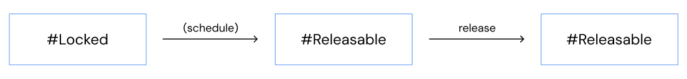
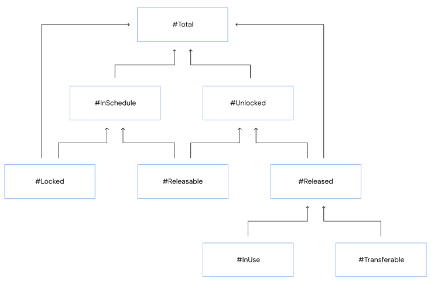
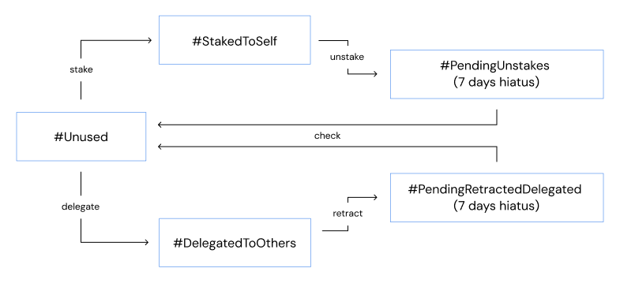
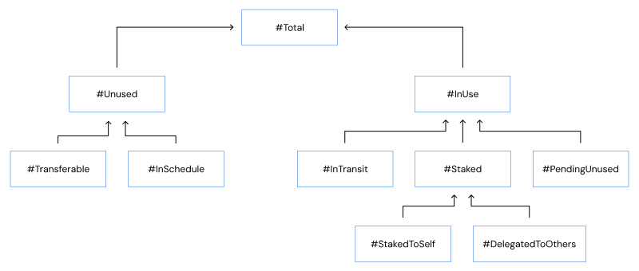

# $MPC token model and Account Elements

The MPC Token is the native token of the Partisia Blockchain used for staking and bootstrapping the ecosystem via MPC tokens as rewards. All Accounts and contracts on the blockchain can own MPC tokens. Staking in the context of MPC tokens means, that a stake of MPC tokens works as the entry ticket to becoming a node operator and allows them to take fees for services. The staking requirements for different tasks can be read [here](../node-operations/start-running-a-node.md). The stake of a node can be used to pay compensation for misconduct committed with the node.

## Terminology

- The following terminology is used in this document
- Account: A Partisia Blockchain address (the public key)
- Contract: A Partisia Blockchain address
- Token Holder: A user who owns MPC Tokens
- Node Operator: A user who runs a blockchain Node
- Stake: The use of MPC tokens as collateral for running on-chain services on Partisia Blockchain
- Delegated Staking: The action of delegating Token holders' own MPC tokens to a node operator that can use the Delegated Stakes for running jobs
- Retract Delegated Stakes: The request by a token holder to terminate Delegated Staking
- Community Staking: The service that simplifies Delegated Staking

## On-chain account information

All computations defined in this document can be computed based on the on-chain account information.

The on-chain account information is defined in the source code for the blockchain <https://gitlab.com/partisiablockchain/governance/account-plugin>

Below is an example of the on-chain account information for a given account taken from <https://testnet.partisiablockchain.com/info/account/00c46f56cd02c35543cf41c23cb24909b29539ead4>

```json
{
  "accountCoins": [
    {
      "balance": "0"
    },
    {
      "balance": "960"
    }
  ],
  "delegatedStakesFromOthers": [],
  "delegatedStakesToOthers": [
    {
      "key": "009dc1601d9a0d8ef4dca2a975dec56abca3b000f3",
      "value": "650000"
    }
  ],
  "mpcTokens": "-900000",
  "pendingRetractedDelegatedStakes": [
    {
      "key": "1667550993833",
      "value": "250000"
    }
  ],
  "pendingUnstakes": [],
  "spentFreeTransactions": {
    "epoch": "0",
    "spentFreeTransactions": "0"
  },
  "stakeable": true,
  "stakedToContract": [],
  "stakedTokens": "0",
  "storedPendingStakeDelegations": [],
  "storedPendingTransfers": [],
  "vestingAccounts": [
    {
      "releaseDuration": "60000",
      "releaseInterval": "60000",
      "releasedTokens": "0",
      "tokenGenerationEvent": "1664582400000",
      "tokens": "1000000"
    }
  ]
}
```

The fields of the [on-chain account information](https://partisiablockchain.gitlab.io/governance/account-plugin/com/partisiablockchain/governance/account/Balance.html) holds the following. The MPC token model described in the next section will give an overview and detailed computations for how the information can be aggregated meaningfully.

- `mpcTokens`: The total amount of MPC tokens that are transferable. This number can be negative if more tokens are in use than the released amount. Example: An account has 100 free tokens and 250 released: mpcTokens = 100. After staking 150: mpcTokens = -50
- `stakedTokens`: The total amount of MPC tokens that are staked to the account itself. To run on-chain jobs the staked MPC tokens must be associated with a specific contract. See stakedToContract
- `stakedToContract`: The amounts of staked MPC tokens that are associated with running specific blockchain jobs. Not all staked tokens have to be associated with jobs, hence the sum of "stakedToContract" does not always equal "stakedTokens"
- `pendingUnstakes`: MPC tokens which were staked, and are now being unstaked. When unstaking MPC tokens there is a 7 days waiting period during which they are kept here as pendingUnstakes
- `spentFreeTransactions`: Keeps track of the number of free transactions used in each epoch. Irrelevant for MPC token calculations described in this document
- `vestingAccounts`: MPC tokens that are locked which will become unlocked (freely transferable) after each unlock in the unlocking schedule. Note that the variable called "vestingAccounts" refers to "unlocking schedules". The user receives all tokens locked, but they gradually become unlocked. Note that both locked and unlocked tokens can be used for Staking and for Delegated Staking.
- `storedPendingTransfers`: Keeps track of incoming/outgoing transfers of MPC tokens and BYOC coins while a two-phase commit protocol is being executed
- `storedPendingStakeDelegations`: Keeps track of incoming/outgoing delegated MPC tokens while a two-phase commit protocol is being executed
- `delegatedStakesFromOthers`: MPC tokens delegated from other users. If they are accepted MPC tokens delegated from others can be used for running on-chain jobs
- `delegatedStakesToOthers`: MPC tokens delegated to other users for them to use as stake
- `pendingRetractedDelegatedStakes`: MPC tokens, which were delegated to another user and are now being retracted and freed. Retraction of delegated MPC tokens has a 7 days waiting period during which they are kept here
- `stakeable`: Specifies if this account is allowed to stake MPC tokens. Irrelevant for MPC token calculations

### On-chain contract information

Contracts can hold MPC tokens similar to accounts. The on-chain contract information is defined, in the [source code](https://gitlab.com/partisiablockchain/governance/account-plugin) for the blockchain.
The [on-chain contract information](https://partisiablockchain.gitlab.io/governance/account-plugin/com/partisiablockchain/governance/account/ContractStorage.html) hold the following:    
- `mpcTokens`: The total amount of MPC tokens this contract holds. This number is always non-negative and transferable. 

If a contract is deleted, the MPC tokens it may have held, are added to the [on-chain context-free information](https://partisiablockchain.gitlab.io/governance/account-plugin/com/partisiablockchain/governance/account/AccountStateLocal.html) which hold the following:
- `removedContractsMpcTokens`: The total amount of MPC tokens that have been collected from deleted contracts that held MPC tokens.

Contracts are simpler than accounts in the token model, since their tokens are always transferable, they can not be staked, and the amount is always non-negative.

Below is an example of the on-chain contract information for a given contract that has received 1 MPC token and can be found [here](https://browser.testnet.partisiablockchain.com/contracts/01a4082d9d560749ecd0ffa1dcaaaee2c2cb25d881)

```json
{
  "accountCoins": [],
  "balance": {
    "sign":true,
    "value":"17337783"
  },
  "iceStakes": [],
  "mpcTokens":"1",
  "storedPendingIceStakes": [],
  "storedPendingTransfers": []
}

```


## Definition of token amounts

Each defined key amount has a unique name starting with a number sign (#), a short description and a computation. The computations use numbers directly from the on-chain account information and other key amounts.

### Total

The total number of MPC tokens owned by an account.

There are three ways of computing the total number of tokens

- The number of tokens that are currently in use plus the number of unused tokens
- The number of tokens released from an unlocking schedule plus the number of tokens still in schedule
- The number of locked tokens plus the number of unlocked tokens

Computation (from on-chain information)

```
#Total = #InUse + #Unused
       = #Released + #InSchedule
       = #Locked + #Unlocked
```

### Transferable

MPC tokens become tradeable when they are released from an unlocking schedule. However, they cannot be transferred to other accounts while they are in use.

The total number of MPC tokens that can be transferred to another account, meaning that they are released and not in use. This number can be negative if more tokens are in use than the released amount (capped at zero in UI).

The mental model for computing the number of transferable MPC Tokens is

```
#Transferable = #Released - #InUse
```

However the amount is available directly in the on-chain information.

Computation (from on-chain information)

```
#Transferable = mpcTokens
```

### Unlocking Schedules

MPC Tokens purchased in pre-sales or allocated to the team are locked inside unlocking schedules for a period of time before they become transferable. Unlocking schedules for most token holders are 4 years and tokens gradually become releasable from the schedules. Eventually all tokens will be released.

This is the flow for MPC token unlocking



The following illustrates how the total is calculated based on locked/unlocked tokens or tokens inside/outside unlocking schedules.



### In Schedule

The number of MPC tokens that are inside an unlocking schedule.

Computation (from on-chain information)

```
#InSchedule= sum(vestingAccounts.tokens - vestingAccounts.releasedTokens)
```

### Releasable

The number of MPC tokens that are ready to be released from an unlocking schedule. When they are released they become unlocked.
Computation (from on-chain information)

```
#Releasable= sum( amountPerBatch(v)* batchesReleased(v) - v.releasedTokens ) where v in vestingAccounts
```

with the following functions, where divisions use integer math (rounding down)

```
amountPerBatch(v) = v.tokens / (v.releaseDuration / v.releaseInterval )
batchesReleased(v) = max( 0,  effectiveProductionTime(v) - v.tokenGenerationEvent ) / v.releaseInterval 
effectiveProductionTime(v) = 
    blockProductionTime                                                                                    if p.releaseDuration==62899200000 and p.releaseInterval==7862400000
    max( min( 1684540800000, blockProductionTime), blockProductionTime - (1747699200000 - 1684540800000))  otherwise 
```

### Locked

The number of MPC tokens that are currently locked inside an unlocking schedule.

Computation (from on-chain information)

```
#Locked = #InSchedule - #Releasable
```

### Released

The number of MPC tokens that are released from an unlocking schedule. These can be transferred if they are not in use.
Notice, that #Transferable may be negative if many tokens in unlock schedules are currently in use.

Computation (from on-chain information)

```
#Released = #InUse + #Transferable
```

### Unlocked

The number of MPC tokens that either have been released or are releasable from an unlocking schedule.

Computation (from on-chain information)

```
#Unlocked= #Released  + #Releasable
```

## Using tokens

MPC tokens can be staked as collateral by nodes to perform different blockchain jobs. Token holders can stake their MPC tokens to run their own blockchain node or they can delegate their MPC tokens to another account which uses the tokens as stake to run a blockchain node.

This is the flow for MPC tokens when staking to yourself and delegating to others

The following illustrates how the total number of tokens can be calculated based on tokens that are in use and unused tokens.



### InUse

The number of MPC tokens that are currently in use as stake. This also includes tokens in transit or tokens that are pending to be unused.

Computation (from on-chain information)

```
#InUse = #Staked + #PendingUnused + #InTransit
```

### Staked

The total number of MPC tokens that are staked towards running blockchain jobs.

Computation (from on-chain information)

```
#Staked = #StakedToSelf + #DelegatedToOthers
```

### StakedToSelf

The number of MPC tokens that are staked to the account itself as collateral for running a blockchain node performing different jobs. When an account registers as a Node Operator some tokens are automatically staked as part of the registration process.

Computation (from on-chain information)

```
#StakedToSelf = stakedTokens
```

### DelegatedToOthers

The number of MPC tokens that have been delegated to other accounts, which can use the tokens as stake to run a blockchain node.

Computation (from on-chain information)

```
#DelegatedToOthers = sum(delegatedStakesToOthers.value)
```

### PendingUnused

The total number of MPC tokens that have been unstaked or retracted from delegation and are still pending. When a 7 day hiatus period has passed the tokens will become unused.

Computation (from on-chain information)

```
#PendingUnused = #PendingUnstakes + #PendingRetractedDelegated
```

### PendingUnstakes

The number of MPC tokens staked to the account itself that have been unstaked, but are still pending (7 days period hiatus).

Computation (from on-chain information)

```
#PendingUnstakes = sum(pendingUnstakes)
```

### PendingRetractedDelegated

The number of stakes delegated to others accounts that have been retracted, but are still pending (7 days period hiatus).

Computation (from on-chain information)

```
#PendingRetractedDelegated = sum(pendingRetractedDelegatedStakes.value)
```

### InTransit

The number of MPC tokens that are in transit in either delegation or token transfer.

Transactions which move MPC tokens between accounts relies on a two-phase commit protocol. During the execution of this protocol tokens are in transit. Usually tokens are only in transit for a very short time, but under special circumstances tokens can be in transit for longer.

Computation (from on-chain information)

```
#InTransit = #InTransitTransfer + #InTransitDelegated
```

### InTransitTransfer

The number of MPC tokens that are in transit as part of a token transfer to another account.

Computation (from on-chain information)

```
#InTransitTransfer = sum( transferValue(p)) where p in storedPendingTransfers
```

where

```
transferValue(p) =
    p.amount if p.coinIndex==-1 and p.addTokensOrCoinsIfTransferSuccessful==false
    0        otherwise
```

### InTransitDelegated

The number of MPC tokens that are in transit as part of a token delegation to another account.

Computation (from on-chain information)

```
#InTransitDelegations  = sum( delegationValue(p)) where p in storedPendingStakeDelegations
```

where

```
delegationValue(p) =
    p.amount if p.delegationType==DELEGATE_STAKES or p.delegationType==RETURN_DELEGATED_STAKES
    0        otherwise
```

### Unused

The total number of MPC tokens that are not currently used, but which can be used as stake. These can be transferred if they are not inside an unlocking schedule.

Notice, that #Transferable may be negative if many tokens in unlock schedules are currently in use.

Computation (from on-chain information)

```
#Unused = #InSchedule + #Transferable
```

## Running on-chain jobs

When the account has enough staked MPC tokens it is possible to run a blockchain node which performs different on-chain jobs. The staked MPC tokens can originate from the account itself and/or be delegated from other accounts as described above. When receiving delegated MPC tokens from others the account owner can choose how many of the tokens to accept as stake for running jobs.

This is the flow for handling MPC tokens delegated from others.



### DelegatedFromOthers

The total number of MPC tokens that have been delegated by others.

Computation (from on-chain information)

```
#DelegatedFromOthers = #PendingFromOthers + #AcceptedFromOthers
```

### PendingFromOthers

The total number of MPC tokens that have been delegated by others, but which have not been accepted.

Computation (from on-chain information)

```
#PendingFromOthers = sum(delegatedStakesFromOthers.value.pendingDelegatedStakes)
```

### AcceptedFromOthers

The total number of MPC tokens that have been delegated by others and accepted.

Computation (from on-chain information)

```
#AcceptedFromOthers = sum(delegatedStakesFromOthers.value.acceptedDelegatedStakes)
```

### StakeForJobs

The total number of MPC tokens that have been staked and can be used for running jobs as a blockchain node. This includes both stakes form the account itself and accepted stakes delegated from others

Computation (from on-chain information)

```
#StakeForJobs = #StakedToSelf + #AcceptedFromOthers
```

### AllocatedToJobs

The total number of MPC tokens that have been allocated towards running specific jobs such as baker jobs, zk computation jobs or oracle jobs. This number is always smaller than or equal to #StakeForJobs.

Computation (from on-chain information)

```
#AllocatedToJobs = sum(stakedToContract.value)
```

## Overview

| Name                         | Computation                                                                                                                                                                                                                                                                                                                                                                                                                                                                                                                                      |
|------------------------------|--------------------------------------------------------------------------------------------------------------------------------------------------------------------------------------------------------------------------------------------------------------------------------------------------------------------------------------------------------------------------------------------------------------------------------------------------------------------------------------------------------------------------------------------------|
| Total                        |                                                                                                                                                                                                                                                                                                                                                                                                                                                                                                                                                  |
| `#Total`                     | `#Released + #InSchedule`                                                                                                                                                                                                                                                                                                                                                                                                                                                                                                                        |
| `#Total`                     | `#Locked + #Unlocked`                                                                                                                                                                                                                                                                                                                                                                                                                                                                                                                            |
| `#Total`                     | `#InUse + #Unused`                                                                                                                                                                                                                                                                                                                                                                                                                                                                                                                               |
| Transferable                 |                                                                                                                                                                                                                                                                                                                                                                                                                                                                                                                                                  |
| `#Transferable`              | `mpcTokens`                                                                                                                                                                                                                                                                                                                                                                                                                                                                                                                                      |
| Unlocking Schedules          |                                                                                                                                                                                                                                                                                                                                                                                                                                                                                                                                                  |
| `#Locked `                   | `#InSchedule - #Releasable`                                                                                                                                                                                                                                                                                                                                                                                                                                                                                                                      |
| `#InSchedule`                | `sum(vestingAccounts.tokens - vestingAccounts.releasedTokens)`                                                                                                                                                                                                                                                                                                                                                                                                                                                                                   |
| `#Releasable`                | `#Releasable= sum( amountPerBatch(v)* batchesReleased(v) - v.releasedTokens )`<br>`where`<br>`amountPerBatch(v) = v.tokens / (v.releaseDuration / v.releaseInterval )`<br>`batchesReleased(v) = max( 0,  effectiveProductionTime(v) - v.tokenGenerationEvent ) / v.releaseInterval`<br>`effectiveProductionTime(v) = `<br>`blockProductionTime if`<br>`p.releaseDuration==62899200000 and`<br>`p.releaseInterval==7862400000`<br>`max(min(1684540800000, blockProductionTime), blockProductionTime - (1747699200000 - 1684540800000)) otherwise` |
| `#Released`                  | `#InUse + #Transferable`                                                                                                                                                                                                                                                                                                                                                                                                                                                                                                                         |
| `#Unlocked`                  | `#Released  + #Releasable`                                                                                                                                                                                                                                                                                                                                                                                                                                                                                                                       |
| Using Tokens                 |                                                                                                                                                                                                                                                                                                                                                                                                                                                                                                                                                  |
| `#InUse`                     | `#Staked + #PendingUnused + #InTransit`                                                                                                                                                                                                                                                                                                                                                                                                                                                                                                          |
| `#Staked`                    | `#StakedToSelf + #DeletatedToOthers`                                                                                                                                                                                                                                                                                                                                                                                                                                                                                                             |
| `#StakedToSelf`              | `stakedTokens`                                                                                                                                                                                                                                                                                                                                                                                                                                                                                                                                   |
| `#DelegatedToOthers`         | `sum(delegatedStakesToOthers.value)`                                                                                                                                                                                                                                                                                                                                                                                                                                                                                                             |
| `#PendingUnused`             | `#PendingUnstakes + #PendingRetractedDelegated`                                                                                                                                                                                                                                                                                                                                                                                                                                                                                                  |
| `#PendingUnstakes`           | `sum(pendingUnstakes.value)`                                                                                                                                                                                                                                                                                                                                                                                                                                                                                                                     |
| `#PendingRetractedDelegated` | `sum(pendingRetractedDelegatedStakes.value)`                                                                                                                                                                                                                                                                                                                                                                                                                                                                                                     |
| `#InTransit`                 | `#InTransitTransfer + #InTransitDelegated`                                                                                                                                                                                                                                                                                                                                                                                                                                                                                                       |
| `#InTransitTransfer`         | `#InTransitTransfer = sum( transferValue(p)) where p in storedPendingTransfers`<br>`where `<br>`transferValue(p) =`<br>`p.amount if`<br> `p.coinIndex==-1 and`<br>`p.addTokensOrCoinsIfTransferSuccessful==false`<br>`0 otherwise`                                                                                                                                                                                                                                                                                                               |
| `#InTransitDelegated`        | `#InTransitDelegations  = sum( delegationValue(p)) where p in storedPendingStakeDelegations`<br>`where`<br>`delegationValue(p) =`<br>`p.amount if`<br>`p.delegationType==DELEGATE_STAKES or`<br>`p.delegationType==RETURN_DELEGATED_STAKES`<br>`0 otherwise`                                                                                                                                                                                                                                                                                    |
| `#Unused`                    | `#InSchedule + #Transferable`                                                                                                                                                                                                                                                                                                                                                                                                                                                                                                                    |
| Running on-chain jobs        |                                                                                                                                                                                                                                                                                                                                                                                                                                                                                                                                                  |
| `#DelegatedFromOthers`       | `#AcceptedFromOthers + #PendingFromOthers`                                                                                                                                                                                                                                                                                                                                                                                                                                                                                                       |
| `#AcceptedFromOthers`        | `sum(delegatedStakesFromOthers.value.acceptedDelegatedStakes)`                                                                                                                                                                                                                                                                                                                                                                                                                                                                                   |
| `#PendingFromOthers`         | `sum(delegatedStakesFromOthers.value.pendingDelegatedStakes)`                                                                                                                                                                                                                                                                                                                                                                                                                                                                                    |
| `#StakeForJobs`              | `#StakedToSelf + #AcceptedFromOthers`                                                                                                                                                                                                                                                                                                                                                                                                                                                                                                            |
| `#AllocatedToJobs`           | `sum(stakedToContract.value)`                                                                                                                                                                                                                                                                                                                                                                                                                                                                                                                    |
                                                               
