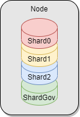

# Sharding 
The Partisia Blockchain uses sharding to ensure scalability of the Basic blockchain
services and transaction speed. Sharding distributes the workload to parallel shards.
All block producing nodes operate all shards. 
PBC has four shards:

- On Shard0, Shard1 and Shard2: Transactions related to contracts deployed by users.
- On ShardGov also called governance shard and ShardNull: Transactions related to the governance contracts. 

## How it works 

