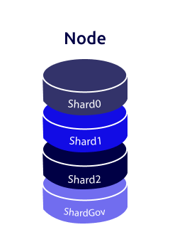

# Sharding 

Sharding separates large databases into smaller, faster, more easily managed parts. The Partisia Blockchain uses sharding to ensure scalability of the Basic blockchain
services and transaction speed. Sharding distributes the workload to parallel shards. All block producing nodes operate all shards. 
Except for the governance shard, all shards serve the same role of distributing the workload. The governance shard has separate responsibilities related to global changes on the chain, these include:

- Changes to which nodes are in committee
- Updates to the governance through votes
- Distribution of fees
- Current active shards and their routing

## How it works

Blocks on PBC are produced and validated in accordance with the [FastTrack](consensus.md) consensus process. which dictates that before a new block is created - the current block proposer must have received proof of justification (PoJ) of the latest block, i.e. a 2/3 majority of the committee members have validated and processed the transactions in the block.
But with shards on PBC, each shard runs its own consensus allowing blocks to be produced on demand. If the activity level on the chain require it, more shards can be added. This allows for PBC to scale continuously.
It is important to note, that each shard is not a separate blockchain. The consolidated chain contains the blocks of all shards, and contracts deployed on different shards can interact seamlessly. In effect sharding is a workload distribution tool, which makes PBC able to produce blocks without delay.

