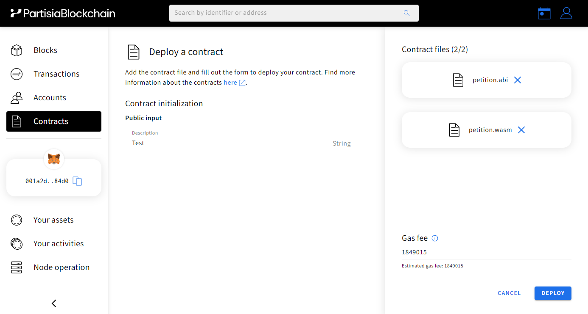
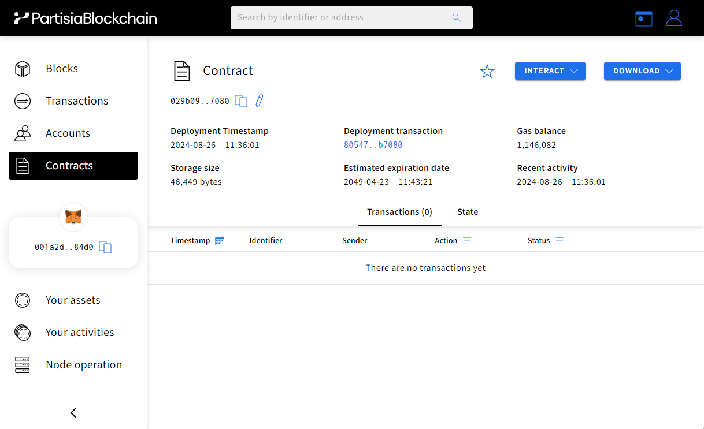

# Compile and deploy contracts

In the following sections we focus on the example petition contract included in the example contracts archive.
The contract utilizes two functions: _initialize_, and _sign_, which 
allow you to perform the basic operations needed start and sign a petition.
After deployment the contract actions can be called from the dashboard. When you perform an action it
changes the contract state. If you inspect the contract you can see the serialized data showing
the contract state.

If you want a developer environment without having to install the compiler yourself you can head over to
our [dApp playground](https://github.com/partisiablockchain/dapp-playground/) to immediately start building

## 1) Compile a contract example

The petition contract can be found in
the [example contracts archive](https://gitlab.com/partisiablockchain/language/example-contracts). After cloning the repository in your machine,
the following will compile it and generate an ABI for it:

```bash
cd example-contracts/rust/petition
cargo pbc build --release
```

Now you will find a .wasm file and an .abi file in:
`/target/wasm32-unknown-unknown/release`.

## 2) Upload the contract to the blockchain

To deploy a smart contract you need an [account](../pbc-fundamentals/create-an-account.md)
with [gas](gas/what-is-gas.md) to cover transaction costs.

To deploy a contract you can visit
the [Partisia Blockchain browser](https://browser.partisiablockchain.com/contracts/deploy).
Ensure that you have some gas. If you want to try for free, follow [these steps](https://partisiablockchain.gitlab.io/documentation/smart-contracts/gas/how-to-get-testnet-gas.html) to get some testnet 
gas to deploy a contract on [the testnet](https://browser.testnet.partisiablockchain.com/contracts/deploy).

Navigate to the Contracts menu in the Browser and click on the "Deploy contract" button. 
Upload the `petition.wasm` and the `petition.abi` files.
The dashboard will then render a form for the initialization function. If you look at `lib.rs` file in your IDE,
you will see that this matches the _initialize_ function.
The _sign_ action will be available after successful deployment.

You can give your petition contract any name by filling-in the Description field.

It should look like this before deployment:



Successful deployment will look like
this:



You are now ready to interact with the contract. You can now click _Interact_ in the browser and start using the sign action.

Congratulations! You have now created an active smart-contract on the Partisia Blockchain.
