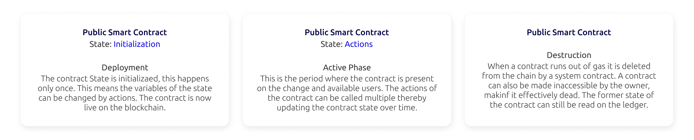

# What is a smart contract

Creating a smart contract is one of the basic ways you can utilize the Partisia Blockchain. A smart contract is a program you run on the blockchain. The conditions of the contract are present across the blockchain. This ensures that actions of the smart contract will happen only once, are trackable and irreversible. In this way a smart contract works independently, without any need for outside authority to facilitate the change in state. So, you do not need a bank or a lawyer to set up a binding agreement anymore, since you have ultimate control over the conditions necessary to make the change happen. Smart contracts are the tool for you if you need to buy, sell, facilitate auctions or administrate portfolios of diverse assets.

## Why use Partisia Blockchain for your smart contracts

What makes the smart contract on Partisia Blockchain different from contracts on other blockchains is that we allow you to add a privacy layer parallel with the [immutable ledger](../pbc-fundamentals/dictionary.md#pbc-ledger). Specifically you can through your contract allocate nodes in the blockchain to handle [Zero Knowledge computation](../pbc-fundamentals/dictionary.md#mpc). If you for example want to create an auction, you can keep the identity of the current bidder and account information secret and off the record, while the identity of the winner and seller will be added to the immutable record. This will secure a record of change in ownership while at the same time preserving the privacy of all interested parties that don’t give the winning bid. This principle of a combination of a privacy layer and a public record means that the Patisia Blockchain effectively replaces the trustee in binding transactions in this example.

## The different contract types and their life on the blockchain

There are three types of smart contracts on PBC:

- **System smart contracts:** The permanent contracts maintaining the PBC Ecosystem, they are involved in the deployment and eventual destruction of the public and private smart contracts as well as a larger number of other essential duties, such as block producer orchestration, preprocessing of data for zero knowledge contracts and changes to procedures on the chain.

- **Public smart contracts:** Public smart contracts are written in the PBC contract language which is based on Rust. A contract has a state which include the variables subject to change. When a user deploys a contract it is sent as a WASM file to a system contract which check the content for type and format validity. Then the public contract is initialized. It is now deployed on the chain and the state of the contract can be changed by the available actions made stipulated in the contract. Actions cannot only change the state of their own contract, but also affect the actions and state of other public smart contracts. An action of a contract affecting an action in another contract is called an interaction (also referred to as event transaction). The transactions constituting the deployment and actions of a contract has a [gas cost](../pbc-fundamentals/byoc-and-gas-for-the-mainnet-and-testnet.md). A public smart contract will be destroyed by a system contract when it hits the expiration date set by the contract creator or if it runs out of gas. You can see the life stages below.

- **Private smart contracts:** Are just like public smart contracts except that the contract stipulates some actions of the contract taking place on the special private layer of the PBC. These actions are zero knowledge computations. Famously PBC supports secure [multiparty computation](../pbc-fundamentals/dictionary.md#mpc) called MPC giving name to the [blockcain's native token](../pbc-fundamentals/dictionary.md#mpc-token).
