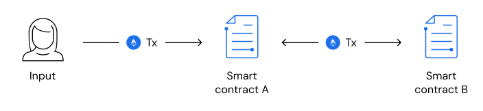

# Contract to contract gas estimation

   
   
   
   
   
   
   [*.*](contract-to-contract-gas-estimation.md)

When creating a contract that sends transactions to other contracts, a developer need to adequately account for the gas required for these transactions. There are two important factors to consider in this process:

1. Total Number of Transactions: Determine the total number of transactions that need to be covered by the gas.
2. Gas Price per Transaction: [Identify the exact gas price for each transaction.](how-to-get-testnet-gas.md#test-your-contract-on-the-testnet)

A contract needs to ensure that it includes enough gas to cover the next set of transactions sent to another contract. This means factoring in the cumulative gas costs of both transactions during the design of the initial transaction. The total cost for the input would be the sum of the gas costs for both the transaction from the first contract to the second contract and from the second contract to the target contract, be it a callback or a third objective.

### Examples

To illustrate, let's consider two contracts: Contract A and Contract B. Contract A needs to ensure that enough gas is sent to Contract B. In this case, the total gas cost for the input would be (Tx → Contract A) + (Tx → Contract B).

Another addition to the above example is if contract A expects a callback from contract B. Then the total price of the gas for any input becomes a total of three transactions: (tx &rarr; contract A) + (tx &rarr; contract B) + (tx callback from contract B &rarr; contract A).
