# Integrating to Partisia as an exchange

Rosetta is an API specification specifically designed to make exchange integration easy. This document describes how our
Rosetta API can be used to create a transfer of tokens from one account to another. It is essentially a tutorial.

All nodes (unless explicitly turned off) will run a Rosetta API endpoint at

```
https://node_hostname.tld/rosetta
```

E.g., the query PBC’s network information, one can make a call
to [/network/list](https://docs.cloud.coinbase.com/rosetta/reference/networklist) which is available at

```
https://node_hostname.tld/rosetta/network/list
```

The rest of the document will use a PBC testnet node as the Rosetta API. The URL of this node is

```
https://node1.testnet.partisiablockchain.com/rosetta/
```

## Networks

All Rosetta endpoints require information about the network that is being queried, so the first step is to figure out
what constitutes a valid network identifier. The list of valid network identifiers can be found by querying the
[/network/list](https://docs.cloud.coinbase.com/rosetta/reference/networklist) endpoint. See the below image.

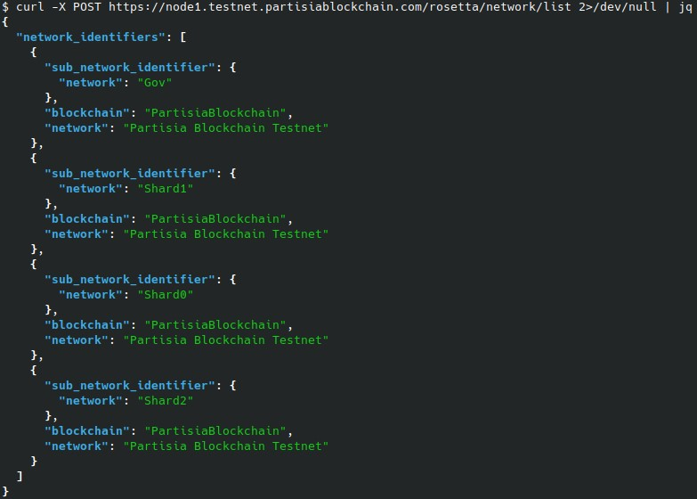

Observe that there are four network identifiers, corresponding to the number of shards running on the PBC testnet. These
shards are “Gov”, “Shard0”, “Shard1”, and “Shard2”. The blockchain (name of the Blockchain) and network (name of the
network) are the same for all shards.

## Accounts

We will use two accounts, residing on two separate shards. This makes the analysis of the transfer slightly more
involved and shows how to trace transactions that spawn events on multiple different shards.

The **sender** is `00e93705fee5c86b30a940fd42398893972a1339ff`

The **receiver** is `0054556c213b1a1d4e081fc2aec67d5f88e05cbca4`

### About addresses

Addresses can be generated using a small piece of Java, as seen below:

```java
KeyPair privateKey = new KeyPair(privateKeyBigInt);
BlockchainPublicKey publicKey = privateKey.getPublic();
BlockchainAddress address = publicKey.createAddress();
```

The [address](../../pbc-fundamentals/dictionary.md#address) on PBC is nothing more than

$$
\textcolor{mathcolor}{
\begin{align}
\text{address } \ = \text{0x00} \|\text{sha256(encode(PK))12...32} \\
\end{align}
}
$$

That is, the last 20 bytes of the SHA256 hash of the public key encoded as x||y, prefixed with the byte
0x00. [An address
on PBC](https://partisiablockchain.gitlab.io/language/contract-sdk/pbc_contract_common/address/struct.Address.html) is
thus 21 bytes in total. The prefixed byte indicates that the address belongs to an account; another byte would
indicate that the address belongs to a smart contract (e.g., 0x03 would indicate that the address belongs to a private
smart contract).

### Shards and addresses

Each address is associated with a particular shard. The method of association is essentially random and not important
for conducting transfers. However, it is necessary to know what shard an address belongs to in order to query
information about.

Figuring out the shard of a particular address can be done through the /call endpoint with the method
“get_shard_for_account”. For example, we learn the shard of our two test addresses by invoking this endpoint with the
following payload:

```json
{
  "network_identifier": {
    "blockchain": "PartisiaBlockchain",
    "network": "Partisia Blockchain Testnet",
    "sub_network_identifier": {
      "network": "Gov"
    }
  },
  "method": "get_shard_for_account",
  "parameters": {
    "address": "00e93705fee5c86b30a940fd42398893972a1339ff"
  }
}
```

Note that the network identifier we need to pass here is the Governance shard.

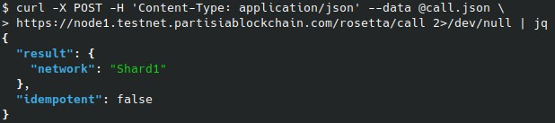

We thus learn that the sender account is located on Shard1. On the other hand, the receiver is found to be located on
Shard2.

### Balances

We can of course also query the current balance of an account. This is done through
the [/account/balance](https://docs.cloud.coinbase.com/rosetta/reference/accountbalance) endpoint.

Here we will use the following query data.

```json
{
  "network_identifier": {
    "blockchain": "PartisiaBlockchain",
    "network": "Partisia Blockchain Testnet",
    "sub_network_identifier": {
      "network": "Shard1"
    }
  },
  "account_identifier": {
    "address": "00e93705fee5c86b30a940fd42398893972a1339ff"
  }
}
```

Note that we are now using the shard that the sender account belongs to. If another shard were used, it would appear as
if the account has no tokens at all. The response we get back will look as follows:

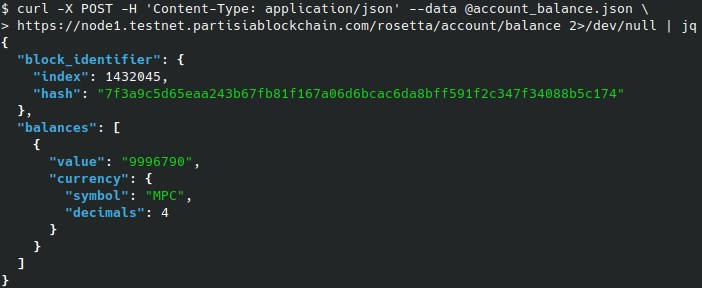

We see that our sender account has 9996790 MPC tokens in their account.

## Executing a transfer

Let us say we wish to transfer 4 MPC tokens from the sender account to the receiver account.

We are going to be following the flow described [here](https://docs.cloud.coinbase.com/rosetta/docs/flow-of-operations#construction-api)

### Preprocessing

The first step is to call
the [/construction/preprocess](https://docs.cloud.coinbase.com/rosetta/reference/constructionpreprocess) endpoint
with the “operations” that we wish to perform. There are
only two operations permitted: `ADD` and `DEDUCT`, and a transfer has one of each (the sender gets an amount of tokens
DEDUCT’ed, and the receiver gets the same amount of tokens ADD’ed.)

The request will contain the below information

```json
{
  "network_identifier": {
    "blockchain": "PartisiaBlockchain",
    "network": "Partisia Blockchain Testnet",
    "sub_network_identifier": {
      "network": "Shard1"
    }
  },
  "operations": [
    {
      "operation_identifier": {
        "index": 0
      },
      "type": "DEDUCT",
      "account": {
        "address": "00e93705fee5c86b30a940fd42398893972a1339ff"
      },
      "amount": {
        "value": "-4",
        "currency": {
          "symbol": "MPC",
          "decimals": 4
        }
      }
    },
    {
      "operation_identifier": {
        "index": 1
      },
      "type": "ADD",
      "account": {
        "address": "0054556c213b1a1d4e081fc2aec67d5f88e05cbca4"
      },
      "amount": {
        "value": "4",
        "currency": {
          "symbol": "MPC",
          "decimals": 4
        }
      }
    }
  ],
  "metadata": {
    "memo": "This is a memo"
  }
}
```

We have also included a memo in the form of the message “This is a memo” that for some will be useful to track the
transfer. The response will be a set of options that we need to pass onto
the [/construction/metadata](https://docs.cloud.coinbase.com/rosetta/reference/constructionmetadata) endpoint. The
metadata endpoint will tell us the current nonce of the account, as well as for how long the transaction should remain
valid. Both these values are required when later forming the actual transaction.

The return value from
calling [/construction/preprocess](https://docs.cloud.coinbase.com/rosetta/reference/constructionpreprocess) with
the above payload is

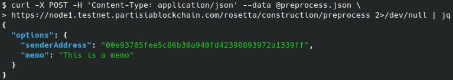

Sending this to [/construction/metadata](https://docs.cloud.coinbase.com/rosetta/reference/constructionmetadata) (
remembering to include the network identifier) will return:

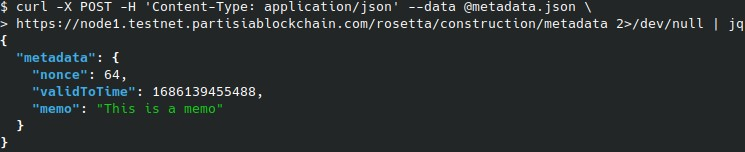

### Creating the unsigned transaction

Using the same operations as above and the metadata, we can now ask Rosetta to construct an unsigned transaction for us
by calling the /[construction/payloads](https://docs.cloud.coinbase.com/rosetta/reference/constructionpayloads)
endpoint. The input to this endpoint is basically the operations from above, and
the metadata object and has been left out here (but it can of course be found in the typescript example that we
include).

The response we get back will look as follows (the bytes in the unsigned transaction has been removed to keep the
request readable.)

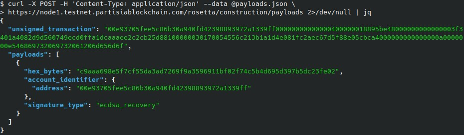

The important part of the above response is the payloads object which tells us (1) what to sign, and (2) the address of
who should sign.

Concretely, we see that the address `00e93705fee5c86b30a940fd42398893972a1339ff` (i.e., our sender) is supposed to sign
the hash
c9aaa...

### Creating the signed transaction

Signing the above unsigned transaction hash is done somewhere else. The result is going to be a “signing_payload” object
as described here. Concretely, the data we will send to the /[construction/combine](https://docs.cloud.coinbase.com/rosetta/reference/constructioncombine) endpoint will look something like:

```json
{
  "network_identifier": {
    "blockchain": "PartisiaBlockchain",
    "network": "Partisia Blockchain Testnet",
    "sub_network_identifier": {
      "network": "Shard1"
    }
  },
  "unsigned_transaction": " UNSIGNED TX BYTES ",
  "signatures": [
    {
      "signing_payload": {
        "hex_bytes": " HASH TO SIGN ",
        "account_identifier": {
          "address": "00e93705fee5c86b30a940fd42398893972a1339ff"
        },
        "signature_type": "ecdsa_recovery"
      },
      "signature_type": "ecdsa_recovery",
      "hex_bytes": " SIGNATURE BYTES "
    }
  ]
}
```

The response we get back is a signed transaction:


### Executing the transfer

At this point, we can ask a Rosetta endpoint to submit our transfer, so it gets executed. This is done through the
[/construction/submit](https://docs.cloud.coinbase.com/rosetta/reference/constructionsubmit) endpoint

The request data is simply the network identifier for the sender’s account, and the signed transaction we got above.

```json
{
  "network_identifier": {
    "blockchain": "PartisiaBlockchain",
    "network": "Partisia Blockchain Testnet",
    "sub_network_identifier": {
      "network": "Shard1"
    }
  },
  "signed_transaction": " SIGNED TX BYTES "
}
```

The response we get is quite simple as well.

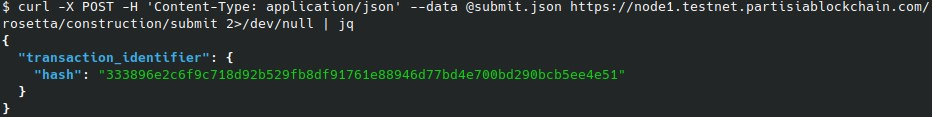

The only information we receive is the hash of the transaction. We will need this in a minute to find our transfer on
chain.

## Finding our transfer

We can find our transfer again. However, this is a little bit tricky. Recall that we transferred 4 MPC tokens between an
account on Shard1 and an account on Shard2. This means that we have to look in two different networks, in order to find
all the relevant information about the transfer.

However, and as we shall see, when looking at transactions through the rosetta endpoint, we will be told explicitly when
a transaction resides on a shard different from the one we’re currently looking at.

### Execution flow

We’ll take a short detour here and outline how a transfer is executed on PBC. Because the sender and receiver might
reside on two different shards, we cannot execute a transfer atomically. Indeed, if the accounts reside on two different
shards, then the sender cannot know ahead of time whether the receiver will be able to receive the tokens, because there
is no information about the receivers shard. Put differently, there has to be some synchronization logic in order to
make sure transactions are executed correctly.

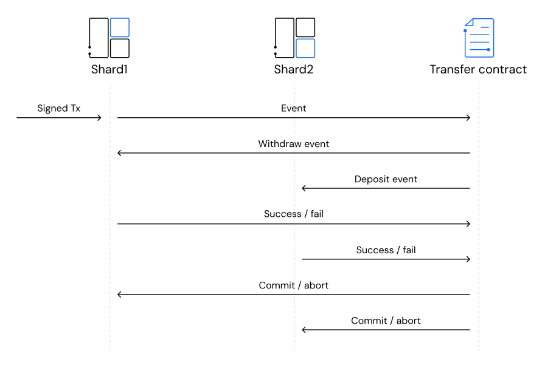

On PBC we use 2-phase commits for transfers, other operations are used to alter the balance of two accounts, such
as [delegated staking operations](../../pbc-fundamentals/mpc-token-model-and-account-elements.md). When the sender’s
signed transaction is submitted, it will generate a
number of events. Some of these events might need to be executed on a different shard than the sender. The flow of
events involved in a transfer is shown above. The transfer contract is shown as residing on a separate shard than the
sender and receiver. This might not be the case (this depends on the shard the contract resides on.)

Using the terminology of two-phase commit, the first two events are “query” messages made by the transfer smart contract
while the last two events (after a positive return value has been received) are the “commit” messages.

## Looking up blocks

We have the hash of the signed transaction, so now we just need to find the transactions for all the events spawned (cf.
the above figure). In particular, we will be interested in the commit events sent at the very end, since these are the
ones which contain the operations telling us how many tokens were transferred.

We will start at the top, and look backwards until we find the block with our transaction in it. Finding the head of the
current chain (of some shard) can be done simply by querying
the [/block](https://docs.cloud.coinbase.com/rosetta/reference/block) endpoint with our network identifier.

A response might look something like this:

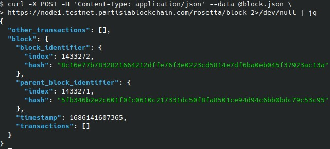

This block has no transactions, so we will look at the parent block instead. This requires adding a “block_identifier”
to our request—namely that of the parent block—but is otherwise straightforward. The transaction we are looking for will
show up under “other_transactions”.

## Looking up transactions

When we have found the block with our transaction in it, we can use
the [/block/transaction](https://docs.cloud.coinbase.com/rosetta/reference/blocktransaction) endpoint to find out
information about our transaction. In particular the operations contained within it.

This endpoint requires both a transaction identifier (i.e., a hash) and a block identifier which is a hash (the block
hash) and an integer (the block height), as seen in the image above. A typical payload may look like

```json
{
  "network_identifier": {
    "blockchain": "PartisiaBlockchain",
    "network": "Partisia Blockchain Testnet",
    "sub_network_identifier": {
      "network": "Shard1"
    }
  },
  "block_identifier": {
    "hash": "a73994ab42c410b7e7c628f5e9966dc279f7ed68de83b0877decbcd2f96a56d5",
    "index": 1433208
  },
  "transaction_identifier": {
    "hash": "008574f7e30acd8f7e68329eee09371bd014d11ffced489ffa4c13dd3fe45e5d"
  }
}
```

A response may look like the picture below:

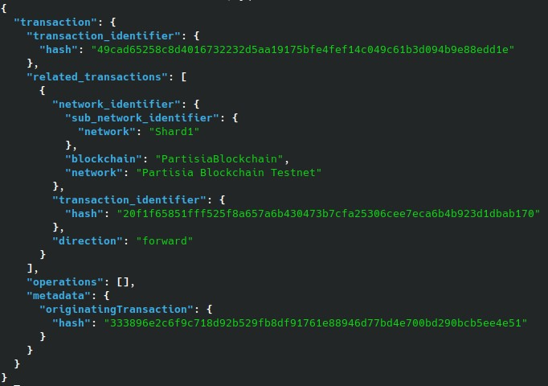

This would be the result if we look up the transaction 49cad6…. The above result has several interesting facets:

- We see that it is a transaction related to another transaction, namely the one with the hash 33389… This in particular
  tells us that this transaction was spawned as part of the other transaction. For example, this transaction could be
  one
  of the events (e.g., the “withdraw”) spawned by the signed transaction we submitted when creating the token transfer
  earlier.
- We see that is a single related transaction to this transaction. Moreover, this related transaction is not located on
  the shard we are currently looking at (Shard1) but on a different shard—Shard2.

## Finding our transfer

We can combine the observations from the previous two sections into a strategy for finding the operations from our
transfers.

Let TX be the hash of the signed transaction. This is the hash returned
by [/construction/submit](https://docs.cloud.coinbase.com/rosetta/reference/constructionsubmit). We submitted this
transaction on Shard1, so that is where we will start. The “algorithm” for finding our operations will use two functions
_“FindBlock”_ and _“SearchTransactions”_.

_FindBlock(shard, block, TX)_

1. Create a request object for /block with the _shard_ (a network identifier object)
2. If _block_ (a block identifier object) is not null, we will include this as well
3. Call [/block](https://docs.cloud.coinbase.com/rosetta/reference/block)
4. For each transaction _T_ in “other_transactions” in the response, if _T=TX_ call _SearchTransactions(shard, block,
   T)_
5. Otherwise, call _FindBlock(shard, B, TX)_ where _B_ is the “parent_block_identifier” in the response

_SearchTransactions(shard, block, T)_

1. Create a request object with shard, T and block
2. Call [/block/transaction](https://docs.cloud.coinbase.com/rosetta/reference/blocktransaction)
3. If “operations” is not empty, then we’re done. Output the operations
4. Otherwise, for each transaction X in “related_transactions”
5. If X has a network identifier S, call FindBlock(S, null, X)
6. Else call SearchTransactions(shard, block, X)

The above two functions essentially start from the top of some shard and then searches through blocks until it finds the
block with our transaction in it. After this, it searches through the events (related transactions) that this
transaction resulted in, in order to find the operations we are seeking.

Because cross-shard transactions are included in a different block (they have to—each shard has its own blocks) we need
to search from the top, as it were, if we find a related transaction that was executed on a different shard than the one
we’re currently looking at.

When the above search terminates, it is because we get a response of the following form:

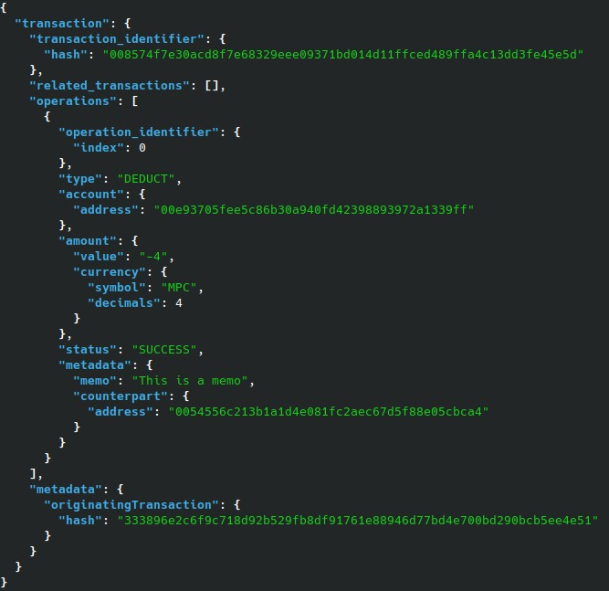

This is a transaction (as returned
by [/block/transaction](https://docs.cloud.coinbase.com/rosetta/reference/blocktransaction)) which contains one of the two
operations of a transfer—here,
the operation responsible for deducting the transfer amount from the sender.

In the above, we see both the type (`DEDUCT`), the amount (4), that the transaction was successfully executed, as well
as
the memo and the account address of the recipient.
