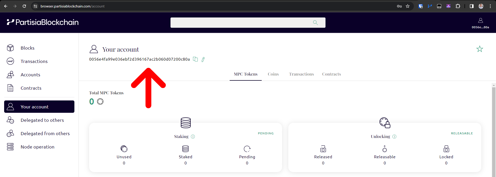

# How to use Ledger on Partisia Blockchain

Ledger is a hardware wallet that is considered one of the mos
t secure ways to store your digital assets. Ledger uses an offline, or cold storage, method of generating private keys.
Ledger is integrated with our block explorer [(Browser)](https://browser.partisiablockchain.com/account).

Install the Partisia Blockchain app on your Ledger device to sign transactions and manage MPC tokens with
the [Partisia Blockchain Browser](https://browser.partisiablockchain.com/account). The Partisia Blockchain app is
developed and supported by the [Partisia Blockchain Foundation](https://partisiablockchain.com/).

!!! note "Requirements: What’s needed before starting"

    * You've initialized your Ledger hardware wallet.
    * The latest firmware is installed.
    * Ledger Live is ready to use.

## Install Partisia Blockchain App on Ledger device

1. Open My Ledger in Ledger Live.
2. Connect and unlock your Ledger device.
3. If asked, allow My Ledger to access your device.
4. Find Partisia Blockchain in the app catalog.
5. Click the Install button of the app.
6. Follow the onscreen instructions on the Ledger device.

## How to connect the Ledger device with Partisia Blockchain Browser?

To connect your device with the Browser you need to have gone through all steps in the above guide.

1. Enter the pin on your Ledger device
   

2. Choose Partisia Blockchain in the Choose app setting
   

3. App is now ready on the Ledger and we can now login using [the Browser](https://browser.partisiablockchain.com)

4. In the top right corner of the Browser you can click _Sign In_ this gives you a menu where you can click _Sign in
   using Ledger_
   

5. You can now see a quick loading screen coming up where it signs you into your Partisia Blockchain Browser with the
   Ledger device.
   

In the top right corner of browser you can copy and see
the [PBC address](../../../pbc-fundamentals/dictionary.md#address) of your Ledger. You can also visit
the [account page](https://browser.partisiablockchain.com/account) to get more detailed viewing of the accounts balance.

## How to receive crypto assets using Ledger

To receive crypto assets you need to save the address of the ledger. This needs to be the receiving end of a MPC
transfer
for Ledger to get assets on the blockchain.

1. Connect your ledger account
   with [Partisia Blockchain Browser](#how-to-connect-the-ledger-device-with-partisia-blockchain-browser).
2. In [your account](https://browser.partisiablockchain.com/account) find the PBC address of your ledger.
   
3. Share your PBC address to receive crypto assets on your ledger device.

## How to send crypto assets using Ledger

After [connecting with browser](#how-to-connect-the-ledger-device-with-partisia-blockchain-browser) you are now ready to
start moving assets around using the Ledger.

1. Go to
   the [MPC token contract](https://browser.partisiablockchain.com/contracts/01a4082d9d560749ecd0ffa1dcaaaee2c2cb25d881)
   where you
   can [transfer MPC tokens](https://browser.partisiablockchain.com/contracts/01a4082d9d560749ecd0ffa1dcaaaee2c2cb25d881/transfer).
   You need to fill out the receiving [address](../../../pbc-fundamentals/dictionary.md) and the amount of MPC tokens
   you want to send.

    Remember the amount of MPC tokens needs to have 4 decimals behind, e.g. if you want to transfer 10 MPC you would
   type: 100000 in the transfer action.
   

2. After sending the transaction to transfer MPC tokens, you can see that the Browser waits for approval on the Ledger
   

3. Review the MPC transfer on the Ledger device by pressing the _right button_ on your Ledger Device and review the
   different transaction details.
   

    The review consists of:

    * Are you using the correct chain? Ledger will in the review write 2 chains, first is: Partisia Blockchain and the
      second is: mainnet. The screenshot shows [testnet](../../access-and-use-the-testnet.md) which is our developer
      chain, in your case it will show up as mainnet.
      

    * Are you using the correct arguments? Its important that you verify the receiving addresses on the device as to
      ensure you are doing the transaction you wanted with the amount you wanted to transfer.
      

    * If you cannot verify the address of the amount you can reject the transaction on the Ledger.
      

4. Accept the amount of [gas](../../../pbc-fundamentals/dictionary.md#gas) the transaction costs.
   

5. If you want to approve after the review you should click on _Approve_ on the device.
   

6. After approval, you can see that the Browser finishes the transaction and the transfer is complete.
   

## How to send blind signed transactions?

If you want to use Ledger to sign all possible transactions on Partisia Blockchain, you need to enable blind signing on
your device. This guide will teach you how to enable blind signing on your ledger device and how to do an ETH token
transfer to another address on PBC with a blind signed transaction.

1. Go to settings on your Ledger device
   

2. Default for Ledger is that blind signing is disabled.
   

3. To enable blind signing click on the right button for enabling blind signing on the Ledger device.
   

This setting update changes how we sign transactions on Partisia Blockchain with the Ledger. The following steps shows
how a blind signed transaction looks like.

1. After signing
   into [browser with the Ledger device](#how-to-connect-the-ledger-device-with-partisia-blockchain-browser), we go to
   the [ETH token contract](https://browser.partisiablockchain.com/contracts/014a6d0fd09fe2e6853a76caedcb46646ab7ee69d6)
   where you
   can [transfer ETH tokens](https://browser.partisiablockchain.com/contracts/014a6d0fd09fe2e6853a76caedcb46646ab7ee69d6/transfer).
   You need to fill out the receiving [address](../../../pbc-fundamentals/dictionary.md) and the amount of ETH tokens
   you want to send to another addres on Partisia Blockchain.

    Remember the amount of ETH tokens needs to
   have [18 decimals](https://partisiablockchain.gitlab.io/documentation/pbc-fundamentals/byoc/bridging-byoc-by-sending-transactions.html#bridgeable-coins-on-mainnet)
   behind, e.g. if you want to transfer 10 ETH BYOC Tokens you would type: 10000000000000000000 in the transfer action.
   

2. After sending the transaction to transfer tokens, you can see that the Browser waits for approval on the Ledger
   

3. We now need to review the transaction on the Ledger
   

4. We get a warning on the device since we are using blind signing and therefore need to trust the content of the RPC
   sent on chain.
   

5. In this review stage of using the ledger we need to verify that it is the right contract we are using. Its always
   important to rigorously review that the available information is correct when blind signing a transaction with
   Ledger.
   

6. We need to accept the fee payment
   

7. If you want to approve after the review you should click on _Approve_ on the device.
   

8. After approval, you can see that the Browser finishes the transaction and the transfer is complete.
   

If you need help in any of the above explained steps, you should go to
the [community Discord](../../../get-support-from-pbc-community.md) where you are able to create support tickets and get
help from the Partisia Blockchain community. 