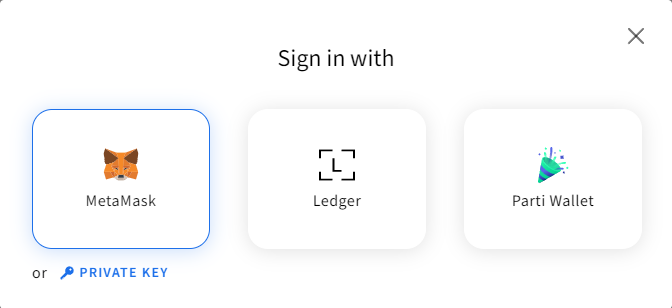
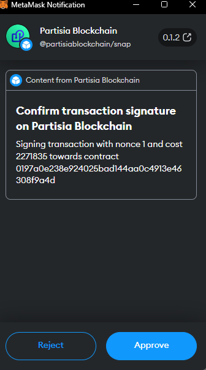

# Partisia Blockchain MetaMask Snap

The Partisia Blockchain MetaMask snap allows users to use MetaMask for signing transactions towards
Partisia Blockchain. The Snap feature is available within the latest version of [MetaMask](https://metamask.io/).

### What does the snap do?

The snap allows users and developers to use MetaMask to sign transactions. It allows getting the Partisia
Blockchain address of the key and to sign transactions.

### How to install and use the snap as a user?

1. Install the latest version of the [MetaMask extension](https://metamask.io/download/).
2. Create a Wallet in MetaMask. You can reuse the seed phrase from PBC wallet if you want to have the same account
   address and private key. You cannot import the private key directly into MetaMask. If you want to use multiple
   wallets with the MetaMask snap you need to follow the MetaMask article
   about: [How to manage multiple wallets](https://support.metamask.io/hc/en-us/articles/12174759849371#h_01GQ58M3T5NQ19NYWTQ1C1XS2M).
   The Partisia Blockchain snap can only use your primary
   MetaMask account when signing transaction on the Partisia Blockchain Browser.
3. Go [to Partisia MetaMask Snap](https://snaps.metamask.io/snap/npm/partisiablockchain/snap/)
4. Click add to MetaMask
5. Sign in with your MetaMask account and accept the terms and conditions for the snap
6. Click "Connect Metamask Snap" - this installs the PBC Snap (Protocol 3757).
7. You now have access to the MetaMask snap

Video tutorial
<iframe width="560" height="315" src="https://www.youtube.com/embed/cdMVVQmyASU?si=u93J9vvArpPhxJgg" title="YouTube video player" frameborder="0" allow="accelerometer; autoplay; clipboard-write; encrypted-media; gyroscope; picture-in-picture; web-share" allowfullscreen></iframe>

To use the newly installed MetaMask snap with Partisia Blockchain

1. Go to [Partisia Blockchain Browser TestNet](https://browser.testnet.partisiablockchain.com/)
   or [Partisia Blockchain Browser MainNet](https://browser.partisiablockchain.com/)
2. In the upper right corner click Sign In
3. Click on the "Sign in using MetaMask" <br> <br>
4. Click the blue connect button
5. You have now successfully signed in to your MetaMask account through Partisia Blockchain Browser tool and can use the
   MetaMask Partisia Blockchain snap to sign transactions to the blockchain
6. Ensure that your PBC account has gas. If you lack gas, find the account address key inside MetaMask, then get some
   gas for the account. For gas on the testnet you can
   visit [our article about getting testnet gas](../access-and-use-the-testnet.md).

We recommend you to try the "Mint 10.000 tokens" action - and examine the transaction
in [Partisia Blockchain Browser](https://browser.testnet.partisiablockchain.com/transactions). If it succeeds it will
appear with the Action named "Mint" in the browser.

#### How to sign a transaction?

When [signing a transaction](../compile-and-deploy-contracts.md) while logged in with the MetaMask extension you will
get prompted with a approval window from the extension with all the details of the transaction.



## Developing dApps with the MetaMask Partisia Blockchain Snap

When developing dApps or other application it can be beneficial to use the MetaMask Partisia Blockchain Snap as it
creates an easy plug-and-play solution to help users sign transactions onto the chain.

As an example on how to integrate and use the snap as part of a dApp we recommend you visit
our [web-client example](https://gitlab.com/partisiablockchain/language/example-web-client).

### How do I install the Snap as a developer?

Using MetaMask `wallet_requestSnaps` with the snap
identifier `npm:@partisiablockchain/snap`.

???+ example "How to install the snap"

      ```javascript
      try {
          const result = await window.ethereum.request({
              method: 'wallet_requestSnaps',
              params: {
                  'npm:@partisiablockchain/snap': {},
              },
          });
          console.log(result);
      } catch (error) {
          console.log(error);
      }
      ```

### How do I get the Partisia Blockchain address of the user?

When the snap has been installed the snap invocation `get_address` will return the address of the user.

???+ example "How to get address of the user"

      ```javascript
      window.ethereum.request({
          method: 'wallet_invokeSnap',
          params: {
              snapId: "npm:@partisiablockchain/snap",
              request: {method: 'get_address'}
          },
      });
      ```

### How do I sign a transaction?

Use the snap method `sign_transaction`. The method requires a parameter object with two fields, `chainId` that is the
chain id of the chain that the transaction
are signed towards and `payload` that
should be a hex encoded transaction. The method will return a hex encoded signature.

???+ example "How to create a signature"

      ```javascript
      window.ethereum.request({
          method: 'wallet_invokeSnap',
          params: {
              snapId: "npm:@partisiablockchain/snap",
              request: {
                  method: 'sign_transaction',
                  params: {
                      payload: payload,
                      chainId: chainId
                  },
              },
          },
      });
      ```

