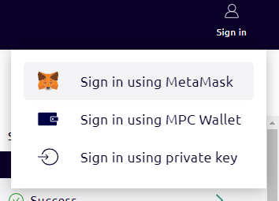

# Partisia Blockchain MetaMask Snap
The Partisia Blockchain MetaMask snap allows dapp developers to use MetaMask for when signing transactions towards
Partisia Blockchain. The Snap feature is available within the latest version of [MetaMask](https://metamask.io/).

### What does the snap do?
The snap allows users to use MetaMask to sign transactions. It allows getting the Partisia
Blockchain address of the key and to sign transactions.

### How to install and use the snap as a user?
1. Go here: https://snaps.metamask.io/snap/npm/partisiablockchain/snap/
2. Click add to MetaMask
3. Sign in with your MetaMask account and accept the terms and conditions for the snap.
4. Press the blue Connect button followed by the blue install button.
5. Confirm the protocol `(Give 3757 (Unrecognized protocol)..)`
6. You now have access to the MetaMask snap

To use the newly installed MetaMask snap with Partisia Blockchain

1. Go to [the browser TestNet](https://browser.testnet.partisiablockchain.com/) or [the browser MainNet](https://browser.partisiablockchain.com/).
2. In the upper right corner press Sign In.
3. Click on the "Sign in using MetaMask"


4. Press the blue connect button.
5. You have now successfully signed in to your MetaMask account through the browser tool and can use the MetaMask Partisia Blockchain snap to sign transactions to the blockchain.


### How do I install the Snap as a developer?
Using MetaMask `wallet_requestSnaps` with the snap
  identifier `npm:@partisiablockchain/snap`.
  
???+ example "How to install the snap"
    ```javascript
    try {
      const result = await window.ethereum.request({
        method: 'wallet_requestSnaps',
        params: {
          'npm:@partisiablockchain/snap': {},
        },
      });
      console.log(result);
    } catch (error) {
      console.log(error);
    }
    ```

**To sign a transaction you can do the following**:

1. Install the latest version of the [MetaMask extension](https://metamask.io/download/).
2. Create a Wallet in MetaMask. You can reuse the seed phrase from PBC wallet if you want to use the same account address and private key.
3. Run the [example-web-client](https://gitlab.com/partisiablockchain/language/example-web-client). **Steps 5, 6 and 7 are done in the example-web-clients interface**.
4. "Connect Metamask Snap" - this installs the PBC Snap (Protocol 3757).
5. Ensure that your PBC account has gas. If you lack gas, find the account address key inside the example-webclient interface, then get some testnet gas for the account. You can visit [our article about getting testnet gas](../access-and-use-the-testnet.md).
6. Now you can use Metamask to sign your transactions.

We recommend you to try the "Mint 10.000 tokens" action - and examine the transaction in [the Browser](https://browser.testnet.partisiablockchain.com/transactions). If it succeeds it will appear with the Action named "Mint" in the browser.

???+ warning "Common Pitfalls"
    If your account has no gas it will still allow you to approve the transaction but will return `error 500`. Make sure that you have [some gas on the account](../access-and-use-the-testnet.md) before signing transactions.

Video tutorial
<iframe width="560" height="315" src="https://www.youtube.com/embed/cdMVVQmyASU?si=u93J9vvArpPhxJgg" title="YouTube video player" frameborder="0" allow="accelerometer; autoplay; clipboard-write; encrypted-media; gyroscope; picture-in-picture; web-share" allowfullscreen></iframe>

### How do I get the Partisia Blockchain address of the user?
When the snap has been installed the snap invocation `get_address` will return the address of the user.
  
???+ example "How to get address of the user"
    ```javascript
    window.ethereum.request({
        method: 'wallet_invokeSnap',
        params: {
          snapId: "npm:@partisiablockchain/snap", 
          request: {method: 'get_address'}},
    });
    ```

### How do I sign a transaction?
Use the snap method `sign_transaction`. The method requires a parameter object with two fields, `chainId` that is the chain id of the chain that the transaction
are signed towards and `payload` that
should be a hex encoded transaction. The method will return a hex encoded signature.
  
???+ example "How to create a signature"
    ```javascript
    window.ethereum.request({
      method: 'wallet_invokeSnap',
      params: {
        snapId: "npm:@partisiablockchain/snap",
        request: {
            method: 'sign_transaction', 
            params: {
                payload: payload, 
                chainId: chainId
            },
        },
      },
    });
    ```

