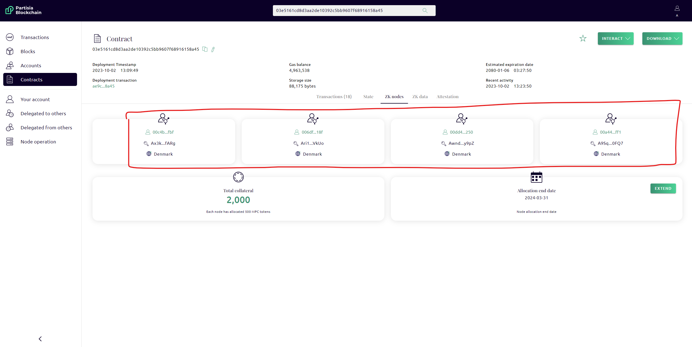

# Live example of PBC as a second layer

<div class="dot-navigation" markdown>
   [](partisia-blockchain-as-second-layer.md)
   [*.*](live-example-of-pbc-as-second-layer.md)
   [](how-to-create-your-own-second-layer-solution.md)
   [](how-to-deploy-your-second-layer-solution.md)
   [](technical-differences-between-eth-and-pbc.md)
</div>

!!! note
Before you can test the already deployed example, you need the following setup:

    1. A [testnet](/docs/testnet.md) [PBC account](/docs/accounts.md) [with gas](/docs/byoc.md)
    2. A test ethereum account with gas on the Goerli testnet. To get some gas on Goerli testnet we used [a faucet from the official docs](https://ethereum.org/en/developers/docs/networks/#goerli)

    We suggest to use [metamask](/docs/accounts.md) for Goerli testnet.

## Casting secret votes on the PBC contract

1. Go
   to [https://browser.testnet.partisiablockchain.com/contracts/03e5161cd8d3aa2de10392c5bb9607f68916158a45?tab=transactions](https://browser.testnet.partisiablockchain.com/contracts/03e5161cd8d3aa2de10392c5bb9607f68916158a45?tab=transactions).
   If the deployed contract is expired you need to [deploy a new example](how-to-deploy-your-second-layer-solution.md)
   to test the live solution.
2. Press the "Interact" dropdown in top right corner followed by the “Cast Vote” button to input your secret vote.
   Choose the "True" option for casting a "yes" vote, or the "False" option for casting a "no" vote.
   Press the "Submit" button to send the secret vote.
3. Your cast vote is now pending confirmation by the computation nodes. This may take a minute or two depending on the
   network activity.
4. You can verify that the vote has been confirmed by inspecting the "Zk data" button.
5. When casting a vote it is added to "pendingInput" and when it has been confirmed it is moved to
   the "variables" list. You can see that the status changes.
6. In both lists the "variable" has an "owner" field, which contains the address of the PBC account
   that cast the vote.
7. To see that your votes has been confirmed, check that it has been moved from "pendingInput" to
   "variables". You may need to refresh the page to update the state/Zk data.
8. To make the example more interesting you could cast multiple votes, but note that you can only
   cast one vote per account.

## Counting secret votes

!!! note
Before counting votes you should note the id of the current vote. This is required to find the result later.

1. Start the vote counting process by pressing the "Start Vote Counting" button and then "Submit". This will initiate
   the ZK computation and new votes cannot be cast while it is running. The computation can take a minute or two to
   finish.

   If the action fails it might be because another has started the voting before you. You can see if the result shows
   up, otherwise you can retry the Start Vote Counting after a couple of minutes.

2. Once the computation has ended, the result of the vote is added to the list of "vote_results". You may have to
   refresh the page to update the state.
3. Find the result with the vote id that you noted earlier.
4. As this is an open voting example, it may be challenging to fully verify the expected result. However, the result
   should include at least the number of votes cast or more.
5. The result should also contain a proof of the result. The proof is a list of signatures. If it does not contain
   signatures, wait some more and refresh the page.

By following these steps you have now cast a secret vote and counted the result using PBC.

If you encounter any issues while casting your vote or counting the result, you are always welcome to ask for assistance
in our [community](https://partisiablockchain.com/community).

## Transfer the result securely back to Ethereum

These steps shows you how to securely move the vote result to the Ethereum public voting contract while ensuring
integrity.

1. Go
   to [https://goerli.etherscan.io/address/0x591D89F2D1c8869e5cDE32619AA6410DE492D0b3#writeContract](https://goerli.etherscan.io/address/0x591D89F2D1c8869e5cDE32619AA6410DE492D0b3#writeContract).
2. Press the “Contract” button and then the “Write Contract” button to interact with the public contract.
3. Find the “publishResult” action.
4. Fill in the values of the vote result and the proof of the result shown in PBC.
5. Try and alter the result to see for yourself that it is tamper-proof when trying to add votes or other kinds of
   manipulation. You will see that the transaction will fail when doing so.

## Validate the PBC &rarr; Ethereum link

Following the example above, it may be a bit difficult to see how the transfer of data to Ethereum is secured, i.e. who
signs the result of a vote and how does Ethereum verify the signatures?

As illustrated on the [concept page](partisia-blockchain-as-second-layer.md), the result is signed by the same nodes
that run the ZK computation. When trusting these nodes to handle the computation securely, we can also trust them to
sign the result correctly.

To be able to verify the signatures on the Ethereum side, the smart contract needs to know the identities of the
computation nodes. Additionally, the Ethereum smart contract also needs to know the address of the smart contract that
ran the secret vote on PBC.

### Validating contract address

Validating that the Ethereum smart contract links to the right secret voting contract is straight
forward.

[On etherscan](https://goerli.etherscan.io/address/0x591D89F2D1c8869e5cDE32619AA6410DE492D0b3#readContract), find
the `privateVotingPbcAddress` in
the contract state. This is a state variable of 21 bytes, that should correspond to the address of
the secret voting contract on PBC, i.e. `03e5161cd8d3aa2de10392c5bb9607f68916158a45`.

### Validating computation nodes identities

Validating that the Ethereum smart contract knows the computation nodes' identities is a bit more
complicated.

[On etherscan](https://goerli.etherscan.io/address/0x591D89F2D1c8869e5cDE32619AA6410DE492D0b3#readContract), find
the `computationNodes` in
the contract state. This is a list of Ethereum addresses corresponding to the computation nodes on
the PBC secret voting contract.

Next, [on PBC](https://browser.testnet.partisiablockchain.com/contracts/03e5161cd8d3aa2de10392c5bb9607f68916158a45?tab=state)
read the
"ZK nodes". This tab contains 4 objects which holds
information about the ZK computation nodes, including their PBC address listed as "identity".



You may notice that that four addresses listed on the two contracts are not the same. To understand
why this is the case, you can read about how addresses are derived on either chain
[here](technical-differences-between-eth-and-pbc.md).

The four objects also has a field called "public key" which is the public key that corresponds to the private key they
used to sign the voting result. The addresses listed on the Ethereum contract were derived from these keys.

To validate that the keys corresponds to the addresses that the Ethereum contract knows, do the following for each key
_k_ in the "engines" list.

1. Download
   the [example code zk-as-a-service](https://gitlab.com/partisiablockchain/language/contracts/zk-as-a-service/)
2. In the command line, navigate to the `public-voting` directory
3. Run the command
   ```shell
   npx run-func scripts/pbc.js testKey "<PUBLIC_KEY>"
   ```
   Substitute the <PUBLIC_KEY> part with the value of _k_.
4. Read the Ethereum address from the output and check that it matches one of the addresses in the
   Ethereum smart contract's state.
