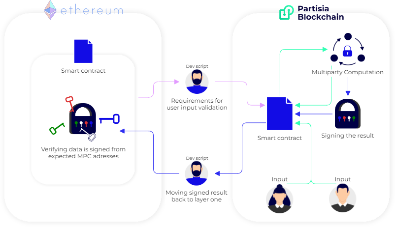

# Partisia Blockchain as a second layer

This article explains how Partisia Blockchain (PBC) can function as a second layer. We will dive into a running example and demonstrate how to test the implementation from a layer one testnet to our [PBC testnet](/docs/testnet.md). Lastly, we will explain how to develop and recreate our testnet solution to get you started with using PBC as a second layer.

To use PBC's zero-knowledge contracts as a second layer to handle privacy, secrecy or other great possibilities, the minimum viable design stays the same.
We need to deploy two smart contracts: one zero-knowledge smart contract on PBC and a public smart contract on the layer one chain. The public functionality of the contracts will be very similar to eachother, the difference is that the contract on PBC can privately calculate the result using zero-knowledge computation. This design can be used on any EVM chain with PBC as second layer.

The author of the contracts determines what information should be publicly available and what should be kept confidential across layer 1 and 2. The users of the smart contracts sends their input to the necessary contracts to either A) give input publicly for layer 1 or 2, or B) give input privately directly to the layer 2 contract on PBC.

To illustrate PBC as a second layer, we will use the model outlined above and describe it with reference to an example that you can find on the following page. This example is based on using Ethereum as the first layer and PBC as the second layer. The scenario involves a voting system where the goal is to privately calculate the results of the votes without revealing how individual voters cast their ballots.

1. A Solidity (.sol) smart contract is deployed on layer 1, in our example layer 1 is Ethereum. The smart contract has the following objectives:
   - It handles the list of allowed voters on the contract.
   - It handles the final verification of the result received from PBC. The contract needs to know the adresses for the nodes picked on PBC to handle the verification.
2. A PBC zero knowledge smart contract is deployed on layer 2. The smart contract has the following objectives:
   - It ensures that only eligible voters belonging to the allowed list are able to submit their vote.
   - It counts the votes privately and then reveals and signs the result. More on this later.
3. When the PBC smart contract is deployed, it selects four [MPC nodes](/docs/partisia-blockchain-dictionary.md#mpc) to perform the zero-knowledge calculation.
4. The list of allowed voters from the .sol contract is transferred onto PBC. Typically an off-chain script is used to move the data between chains. Transferring the list of allowed voters lets the PBC smart contract know which votes it can accept and from whom.
5. Voters submit their votes directly to the PBC smart contract, ensuring confidentiality. The smart contract verifies the sender from the list of allowed voters.
6. The votes secret input are being monitored by the four MPC nodes and individually they take their secret share out of the transaction and saves it to their local storage.

   The MPC nodes are also known as zero-knowledge nodes. The ZK nodes will handle our computation privately without knowing what the vote is since none of the secret shares makes sense on an individual basis. You can read more about the MPC computation [in our dictionary](/docs/partisia-blockchain-dictionary.md#mpc) or read the [article series that explains the math behind MPC](https://medium.com/partisia-blockchain/mpc-techniques-series-part-1-secret-sharing-d8f98324674a).

7. When the smart contract on PBC reaches its deadline the ZK computation for counting the votes can be started by any user.
8. When the computation is complete, the nodes are asked to reveal the result, which is then signed by the nodes.
9. The signed result is transferred back to the Ethereum contract, typically done by another off-chain script.
10. The Ethereum contract verifies that the signatures are from the expected MPC addresses before publishing the vote results on its chain to end the vote.

## How do we handle the information and make sure the middle man is not cheating the users of the smart contracts?

To ensure the integrity of the results calculated on PBC, the signed result will need to be verified on the layer 1 contract before being published. The signatures are created with the private keys of the ZK nodes that have completed the MPC calculation, and the layer 1 contract verifies the signatures to establish the origin of the result as coming from the PBC ZK nodes. The signing from the private keys is the guarantee that it is the nodes themselves who has created the result.

To enable the verification of the signed result, the contract on layer one needs to have the PBC addresses of the ZK nodes used in the computation.
