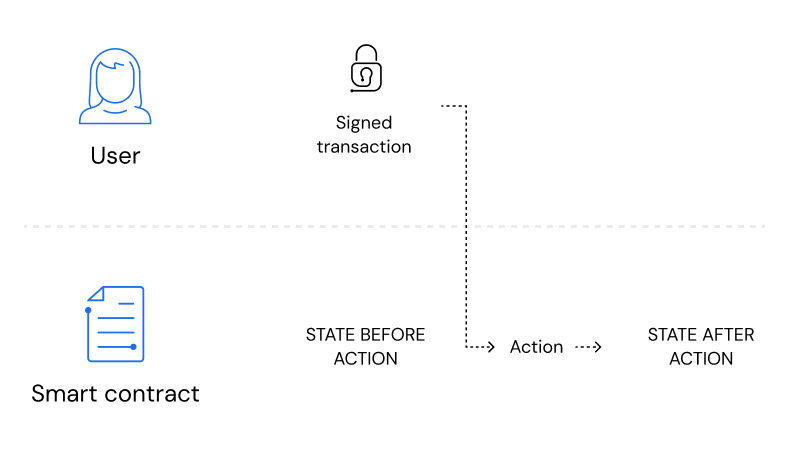
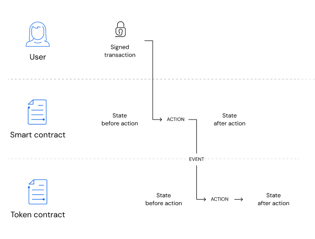
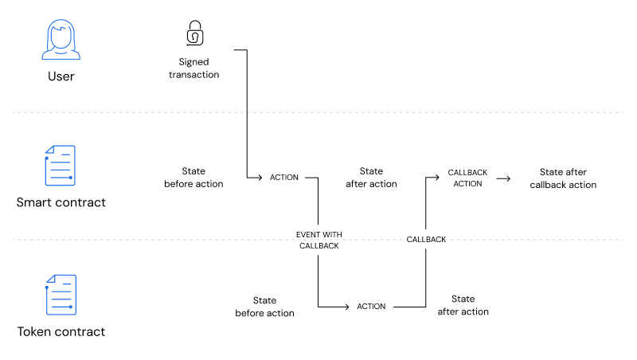
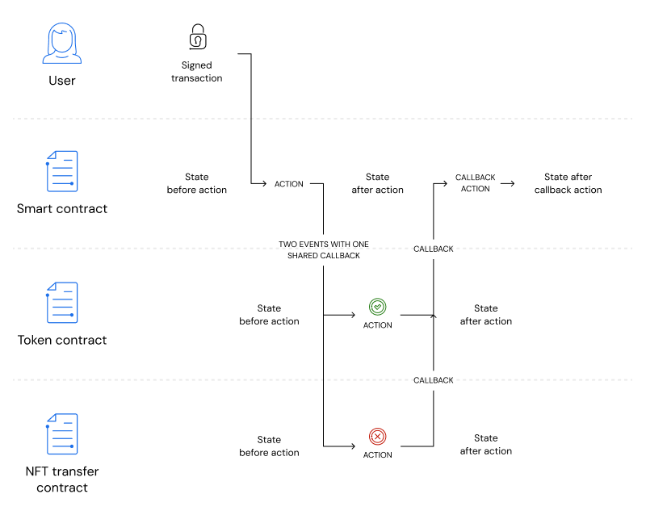

# Smart Contract interactions on the Blockchain

On Partisia Blockchain an _atomic action_ is an indivisible and irreducible series of operations such that either all
occurs, or nothing occurs. A guarantee of atomicity
prevents updates to the blockchain occurring only partially.
Consequently an atomic action is either _successful_ in which case the changes are committed to the blockchain and
visible
for everyone or it _fails_ in which case no state changes on the
blockchain. [Atomicity](<https://en.wikipedia.org/wiki/Atomicity_(database_systems)>) on the Partisia Blockchain works in
the same way as in a database system.

## Simple interaction model

Users change the state of Partisia Blockchain by sending a _signed transaction_ to a _smart contract_. The signature
ensures that the user has authorized the transaction. Users
must cryptographically sign transactions they send to ensure authenticity and non-repudiation.

When the blockchain receives a signed transaction and verified the signature it spawns an _event_ (dotted line), which
is
forwarded to the smart contract. The event carries the information about which _action_ to perform to the smart
contract.
When receiving the event the smart contract will execute the action. This executes the _code_ of the smart contract,
which
results in updating the _state_ of the smart contract. The action code is executed atomically as explained above, meaning
that if the action is _successful_ the state changes are committed to the blockchain and visible for everyone, if it
_fails_
in no state will change on the blockchain. There is no in between in the
interaction layer on the blockchain.

## Contract-to-contract interaction model

Expanding on the simple interaction model, a user sends a signed transaction to a smart contract. The signed transaction
calls the bid action on the auction contract. To perform the bid the auction will ask a token contract to transfer the
amount of tokens from the users account to the auction contract itself as escrow payment. When the bid
action is triggered it spawns a new event which will start the escrow transfer in the token contract. Any of these two
actions can fail and if it does, the atomicity of Partisia Blockchain will ensure that the _failed action_ did not
change the state of the smart contract. If the bid action fails it will never spawn the escrow action-event, only
successful actions can spawn events. Any action can spawn any number of events to other contracts.

## Contract-to-contract with callback

When a user sends a signed transaction, it creates an action. This
action has a _callback_, which is an _anticipatory_ event for a subsequent action
within the same contract.

Expanding on the former example: When creating an auction you would need a callback to give information whether the
token contracts escrow transfer was a success or failure to update the highest bid on your auction contract. A callback
is created when an action is executed within the token contract.
Whether the action creating the callback fails or succeeds it will send the actions status with the callback in
addition to any
data it may
carry. The information sent from the token contract to the auction contract can be changed within the
code of the action. Subsequently, this callback event spawns a callback action for the auction contract, thus changing
the state.

The auction contract callback-starting action sets in motion a potential sequence of state changes.
Typically, the state remains unaltered after the initial action, with transformations anticipated only after the
conclusion of the callback event. In the example you would only want to update the highest bidder if the bid went
succeeded and do nothing if the bid failed. Callbacks, in essence, act as controllers of change when doing contract-to-contract
interactions.

## Contract-to-two-contracts with one callback.

Smart contracts operate _asynchronously_ on PBC. The contracts are placed on any shard within the blockchain's
architecture and events can define what contracts they belong to and what actions they can trigger. _Asynchrony_ is what
enables callbacks to manage multiple actions within the same callback.

Contracts can create events leading to actions in other contracts, and these actions can share a single callback when
initiated from the same action. Callbacks _aggregate_ status updates and responses.

**NOTE**: This is advanced functionality, and can easily be misused! Partisia
Blockchain only provides atomicity on individual events, not across callbacks
and event trees. Individual events may succeed (and have their results
persisted) while event groups containing those events may fail.

**In the case of payment systems you need to check that the payment has been
sent, and is in your possession before sending the bought asset. Such
functionality should not be implemented by sending events that transfer payment
assets and bought assets in the same event group. Doing so may result in
serious exploits.**

