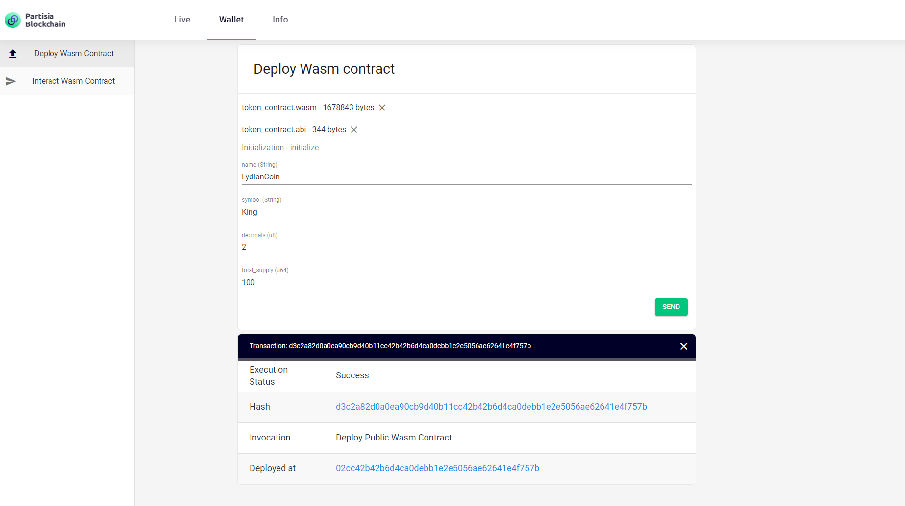

## Develop your first contract

If you are here you should already have familiarised yourself with the prerequisites.
You have an account and have your Linux terminal and Rust environment up and running.
For prices see [Transaction fees](transactions.md).

### Step 1: Download the SDK

Download the [Partisia Contract SDK](LINK_TO_RUST_CONTRACT_SDK) archive containing the Rust project
files and the SDK. The archive contains the `partisia-contract` tool, the SDK and some example contracts.
If you are working with a WSL shell on Windows you can locate files within WSL in the folder named `\\wsl$\Ubuntu\`.
From now on we assume you have extracted the archive to `/tmp/pbc-rust-wasm` (which is `\\wsl$\Ubuntu\tmp\pbc-rust-wasm` in WSL).

Open a terminal and go to the `/tmp/pbc-rust-wasm` folder: `cd /tmp/pbc-rust-wasm`.

### Step 2: Install the cargo `partisia-contract` command

```bash 
cd cargo-partisia-contract
cargo install --path .
```

Test that it worked by executing: `cargo partisia-contract --version`. This should print the version of the command.

### Step 3: Compile the token contract example

The token contract can be found ind `examples/rust-example-token-contract`.
The following will compile it and generate an ABI for it:

```` bash
cd examples/rust-example-token-contract
cargo partisia-contract build --release
````

Now you will find a .wasm-file in called *token_contract.wasm* in: `/tmp/pbc-rust-wasm/token-contract/target/wasm32-unknown-unknown/release`, which is `\\wsl$\Ubuntu\tmp\pbc-rust-wasm\token-contract\target\wasm32-unknown-unknown\release\` in WSL.

If you look at lib.rs file in your IDE, you will see the contract utilizes several functions denoted with the initial *fn*. Three of these functions are actions that allow you to perform the basic operations needed for a transfer. The functions are *initialize*, *mint*, and *transfer*. After deployment, you can call the functions from the dashboard. When you perform an action it changes the contract state. If you inspect the contract you can see the serialized data showing the contract state. You can make sense of the data and see the actual contract state by applying the reader function `fn read_from` from the contract to the datastream.

## Step 4: Upload the contract to the blockchain

Open the wallet in the [dashboard](https://dashboard.partisiablockchain.com/wallet/upload_wasm). Select the `token_contract.wasm` and the `token_contract.abi`. In the Init field you put the number of tokens you want minted for total supply of the contract from the moment of deployment. After you send the contract to the chain a box appears below. You are provided with the following information fields *Execution status*, *Hash*, *Invocation* and *Deployed at*.  Successful deployment will look like
this:



You are now ready to interact with the contract. Copy the address of deployment and paste it into the menu *Interact Wasm Contract*. Now you can mint and transfer your tokens.

<div class="embed-video-wrapper">
<iframe width="711" height="400" src="https://www.youtube.com/embed/qV2grtWDxUE" title="YouTube video player" frameborder="0" allowfullscreen></iframe>
</div>

Congratulations! You have now created an active smart-contract on the Partisia Blockchain. You can add your personalized functions according to your wishes.  
