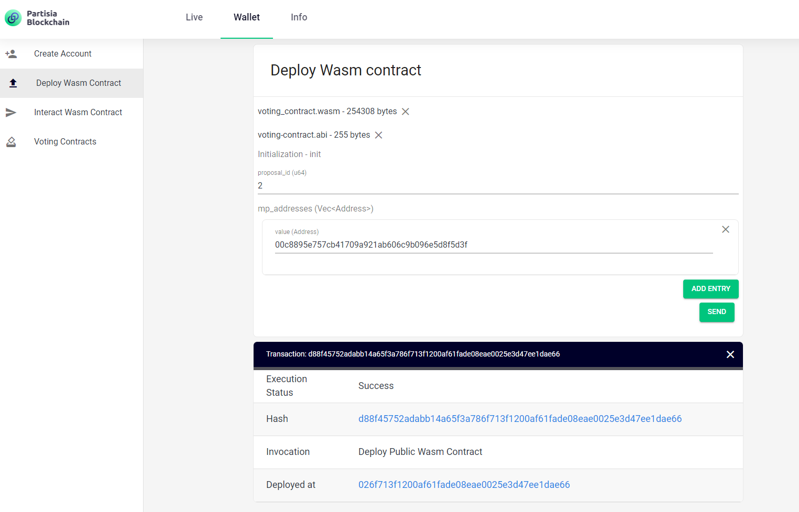

# Create a smart contract for a specific scenario e.g. transparancy in parliament

## Case - Voting record of MPs as a means to strengthen democracy and transparency
The newly founded republic of Faraway is plagued by corruption. To ensure transparency and public mandate behind the parliamentary process the voting record of the elected MPs is added to the blockchain via smart contracts. Using smart contracts enables the public to see how MPs exercise their mandate. Laws that are passed through the smart contract are added to the immutable record, giving all citizens access to the official legal code.


**The setup of our scenario**
- The parliament has 197 MPs.
- Each MP has a key set. The public key enables the public to follow the MP’s voting record on the blockchain. The private key is known only by the individual MP and is used to sign their vote.
- Each time the parliament votes on an issue they do it through a smart contract vote. Laws that passed are therefore also added to the immutable record.


**NB.** No ZK computations necessary since the both individual votes and voting results are supposed to be public.
  
## How to code a smart contract equivalent to our scenario in Rust  

**1) Importing libraries:**  
First we need to import macros and allow use of common library containing functions and types.

````rust
extern crate create_type_derive;
#[macro_use]
extern crate pbc_contract_codegen;
extern crate pbc_contract_common;
extern crate read_write_derive;

use std::collections::{BTreeMap, BTreeSet};
use std::io::{Read, Write};

use pbc_contract_common::abi::field::FieldAbi;
use pbc_contract_common::abi::func::FnAbi;
use pbc_contract_common::abi::types::TypeAbi;
use pbc_contract_common::address::Address;
use pbc_contract_common::context::ContractContext;
use pbc_contract_common::serialization::{ReadInt, ReadWrite};
use pbc_contract_common::typing::CreateType;
````

**2) Defining contract state and generic functions:**  
 You will need a proposal id, so you can identify what propasal the vote is concerned with. Only people with woting rights in the parliment should be allowed to vote, so the contract also needs a list of MP adresses. The votes themselves are contained in a map pairing the votes and voter. Finally, to limit when you can interact with the contract the state also needs to answer if the vote is closed or open. Types in Rust are immutable by default, but the lists and maps that our contract holds needs are not of much use if we cannot change their content. We do that with non static methods using an ````&mut self```` wich is a mutable reference point. That allows the interactions to change the list in the contract state, so when an MP give her ````vote```` it is added with the her ````address```` to the ````votes````. The vote is closed after everybody have voted. We could also choose to make closing the vote depending on when the majority was reached or make an action, where the chairman of the parlament closes the vote after some deadline. We could also add a result to the contract state if we want make the contract more informative. But, the idea here was a voting record, so what we have now will suffice.

````rust
#[state]
pub struct VotingContractState {
    proposal_id: u64,
    mp_addresses: Vec<Address>,
    votes: BTreeMap<Address, u8>,
    closed: u8,
}

impl VotingContractState {
    fn register_vote(&mut self, address: Address, vote: u8) {
        self.votes.insert(address, vote);
    }

    fn close_if_finished(&mut self) {
        if self.votes.len() == self.mp_addresses.len() {
            self.closed = 1;
        };
    }
}
````

 **3) Defining the initialization:**  
 To initialize the contract we need to identify the proposal and constrain who can vote. When we initialize, the beforemetioned contract state becomes live on the chain.

````rust
#[init]
pub fn initialize(
    _ctx: ContractContext,
    proposal_id: u64,
    mp_addresses: Vec<Address>,
) -> VotingContractState {
    assert_ne!(mp_addresses.len(), 0, "Cannot start a poll without parliament members");

    let mut address_set = BTreeSet::new();
    for mp_address in mp_addresses.iter() {
        address_set.insert(*mp_address);
    }
    assert_eq!(mp_addresses.len(), address_set.len(), "Duplicate MP address in input");

    VotingContractState {
        proposal_id,
        mp_addresses,
        votes: BTreeMap::new(),
        closed: 0,
    }
````

**4) Defining the actions of the contract:**  
The only interaction users need to do in this case is voting. We are only allowed to vote when the vote is open and we have an MP address.

````rust

#[action]
pub fn vote(context: ContractContext, state: VotingContractState, vote: u8) -> VotingContractState {
    assert_eq!(state.closed, 0, "The poll is closed");
    assert!(
        state.mp_addresses.contains(&context.sender),
        "Only members of the parliament can vote"
    );
    assert!(
        vote == 0 || vote == 1,
        "Only \"yes\" and \"no\" votes are allowed"
    );

    let mut new_state = state;
    new_state.register_vote(context.sender, vote);
    new_state.close_if_finished();
    new_state
}
````

Go to the [Archive](TransferContractv3.zip).
Download the zip-archive containing the Rust project files and the ABI. (The handwritten ABI will soon be replaced with the ABI-generator, this will allow you to customize the functions of the contract in accordance with your own imagination) The project contains the rust contract layed out above. If you are working with a linux shell from Windows or Mac you need to 
extract the archive in `\\wsl$\Ubuntu\tmp\pbc-rust-wasm\`
To compile run the following commands after changing directory to the  
voting-contract folder:

```` bash
cargo build --target wasm32-unknown-unknown --release
````

Now you will find a .wasm-file in called *voting_contract.wasm* in: 
`\\wsl$\Ubuntu\tmp\pbc-rust-wasm\voting-contract\target\wasm32-unknown-unknown\release\`  
The resulting wasm contract and ABI should be equivalent to this: [wasm and abi](WASMandABI.zip)
You can deploy the contract from the Deploy WASM Contract menu in the [dashboard](https://dashboard.partisiablockchain.com/). Successful deployment will look like this:  

 
